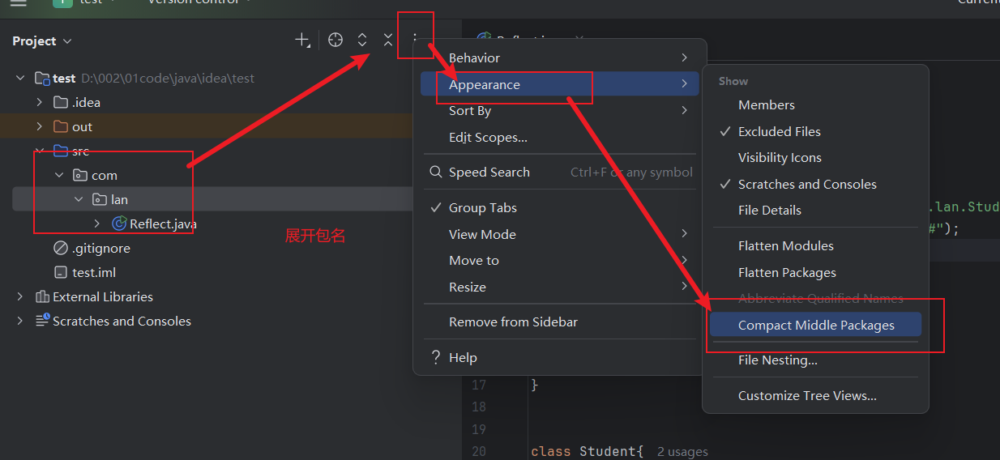

## 注释

单行

多行

**文档注释**

## 标识符&关键字
**字母,$,_**开头,后可有数字

## 数据类型

- 基本类型(primitive type)/引用类型(reference type)

- 强类型语言

  > 变量定义后才使用

- long + L/float + F(不加为double)

- String不是关键字,是类

### 扩展*

*最好避免使用浮点数进行比较*

*必要时要用BigDecimal工具类*

---

所有字符都为数字,存储于Unicode表

转义字符:

## 类型转换

> 高=》低  ————强制类型转换
>
> 低=》高 ————自动转换

## 变量&变量&作用域

> 默认值
>
> 0 / 0.0 / u0000(十六进制) / false
>
> 除基本类型都是null

### 变量

### 常量

final	常量名=值;

### 命名规范

>变量,方法名:驼峰
>
>常量:全大写,下划线分隔
>
>类名:首字母大写

---

## 运算符

关系运算符:instanceof

> Ctrl + D	复制当前行到下一行
>
> *cast转换*?

运算中:有long结果为long,没long结果为int

有double结果为double

### 位运算

### 连接(+)

## 自增减&Math类

### Math工具类:

> Math.函数();
>
> 2的3次方:Math.pow(3,2);

## 包机制

***包的本质是文件夹***(NAT可类比)

*一般使用域名倒置命名*

### 展开包名

---

## JavaDoc生成文档(自己的api文档)

> API的概念

# 高端！！！

> 格式
>
> /**
>
> *
>
> */

> 在文档文件位置打开cmd
>
> 输入
>
> java	文件名(如Doc.java)
>
> 或
>
> java	-encoding	UTF-8	-charset	UTF-8	文件名

作业:使用IDEA生成JavaDoc文档