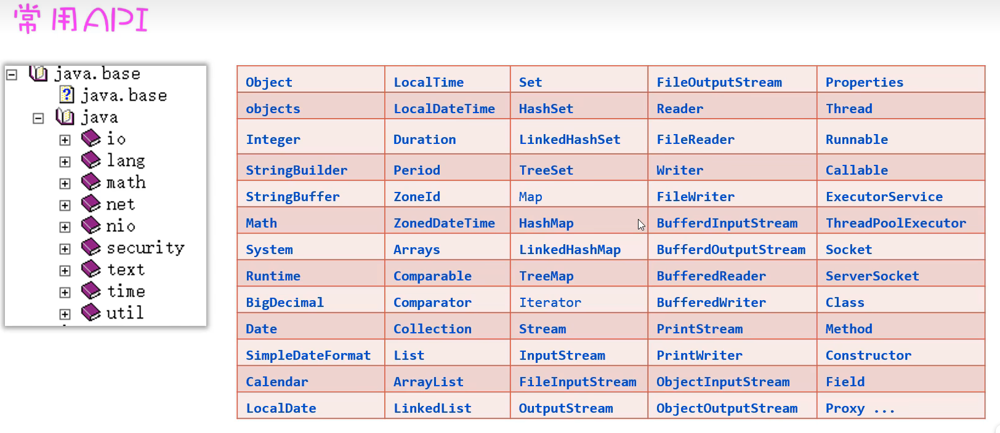
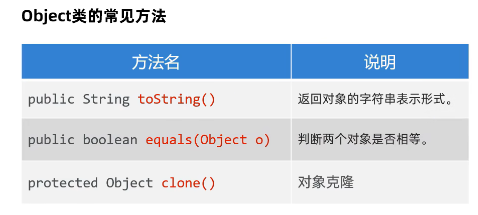
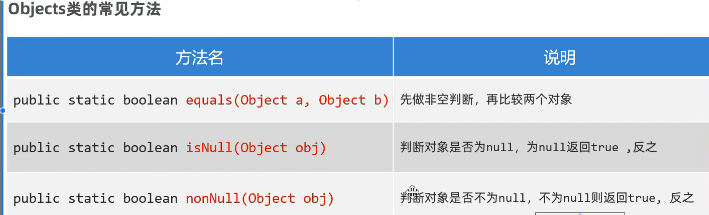
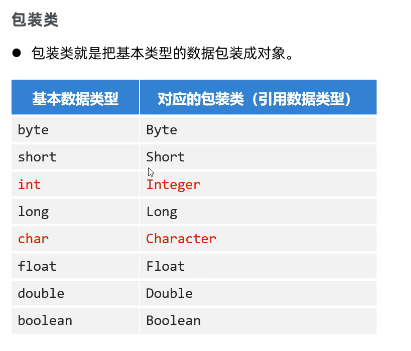
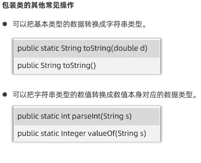
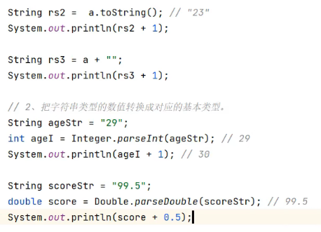

# 常用API



## Object类

> toString()
> equals(Object	o)
> clone



equals:

> o1.equals(o2)
>
> o1可能为空,会报错

默认时比较地址,等价于	"=="

主要方便重写比较规则

## Objects(工具类)

所以用时用	"Objects."	调用



equals:

Objects.equals(o1,o1);

isNull和nonNull和	"==null"(底层)	等价

## 包装类

#### 泛型不能放基本数据类型	!	!

String不是基本类型



Integer.valueOf(int a/String a)

> ```java
> //自动装拆箱
> 
> Integer	a1=12;
> 
> int	a2=a3
> ```





对象.valueOf(String	str)也可以