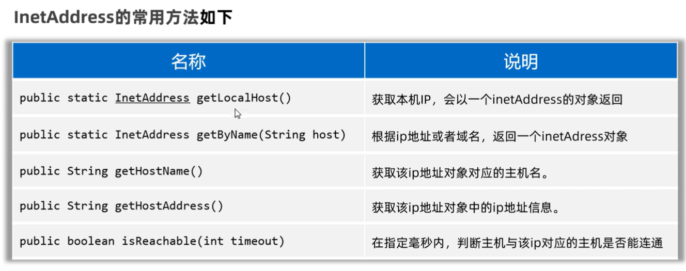
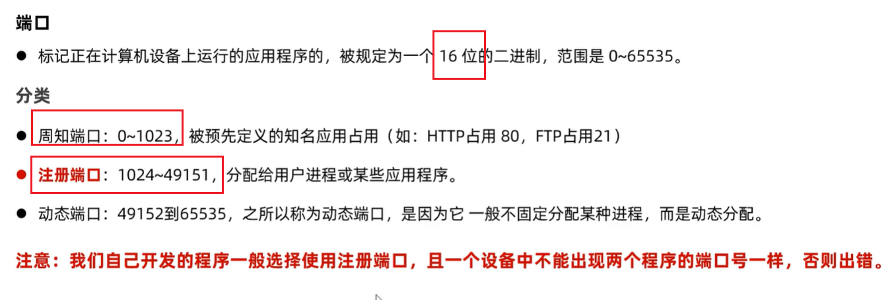
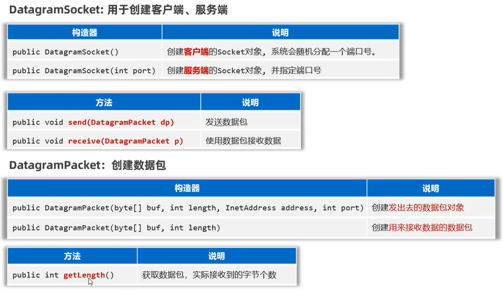
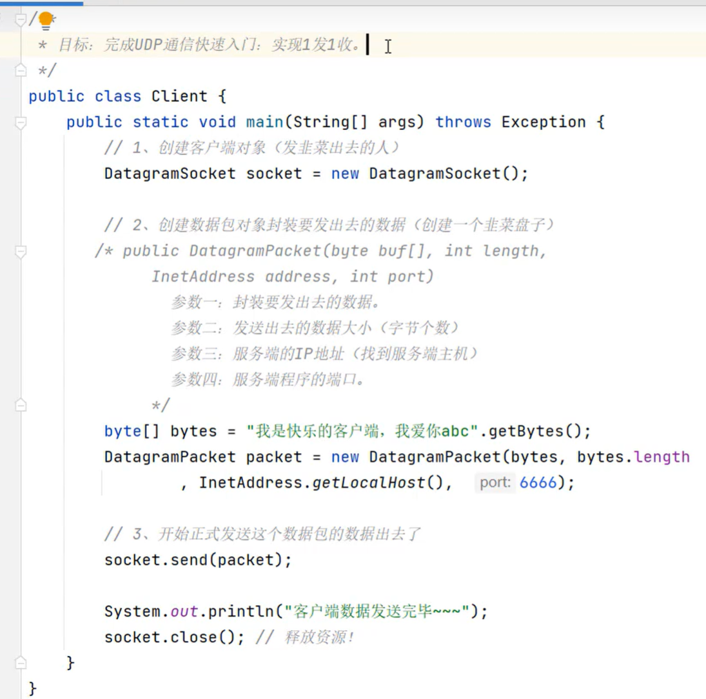
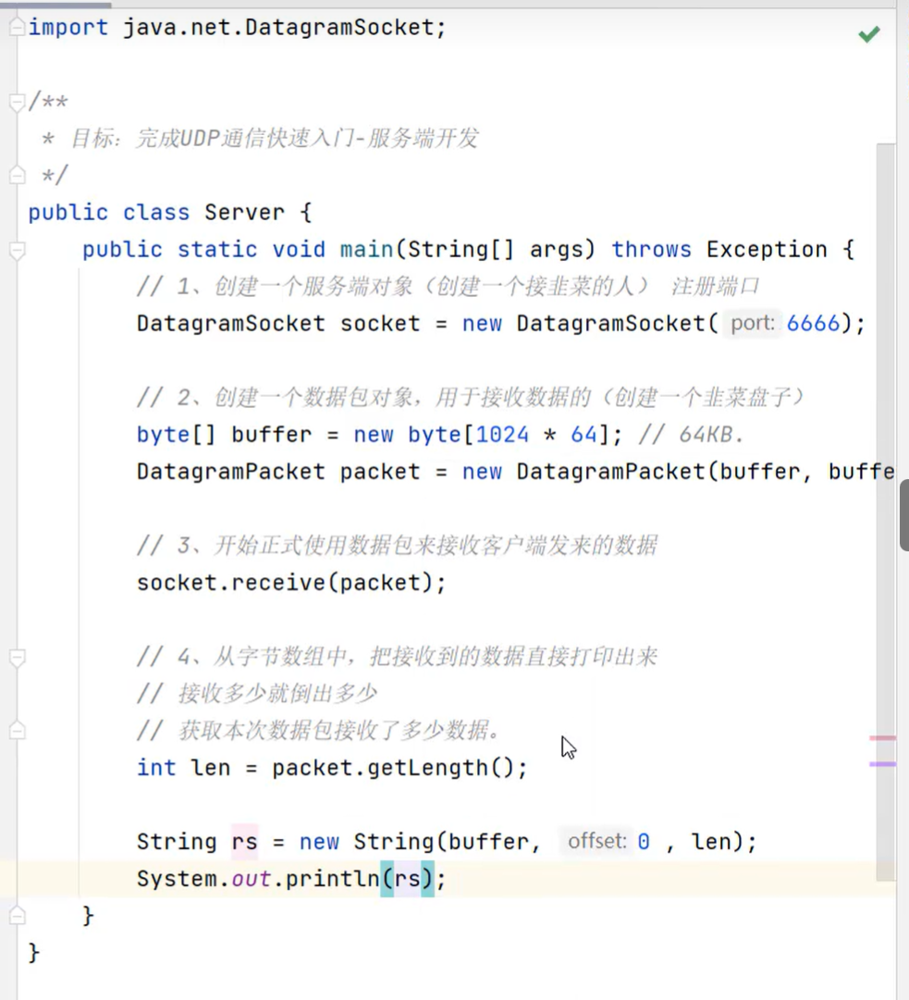
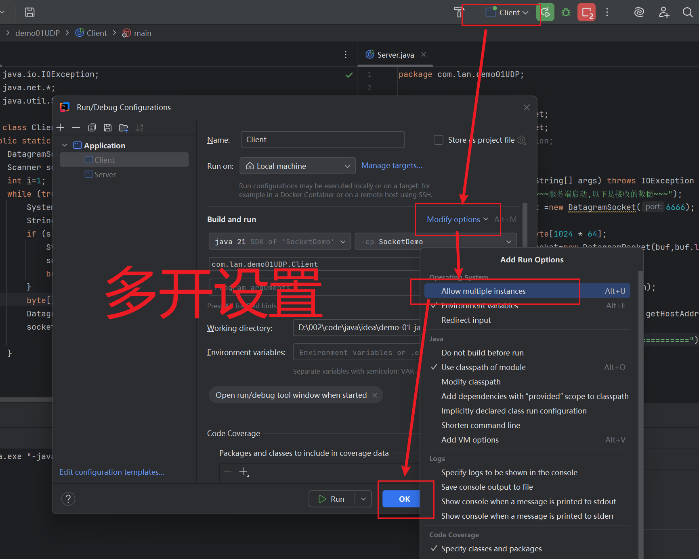
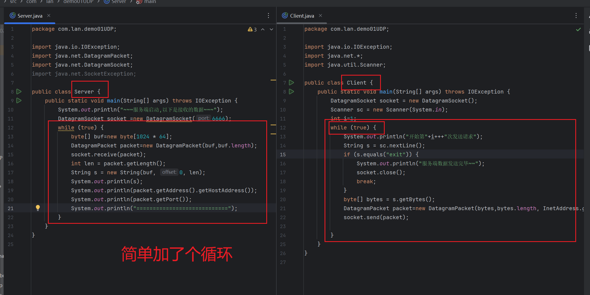
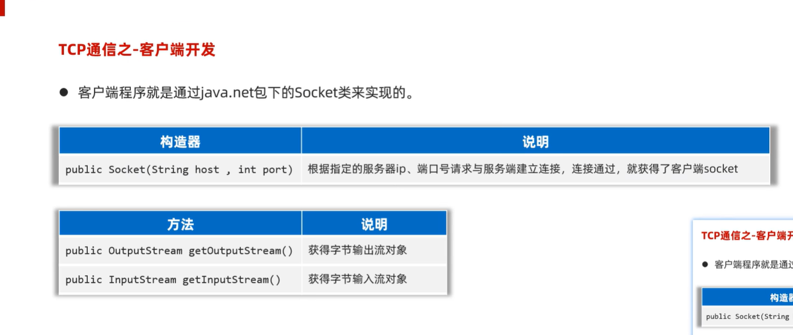
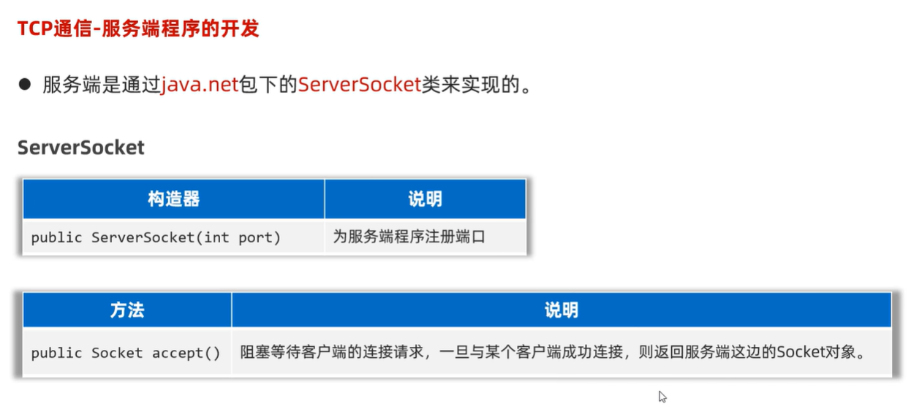
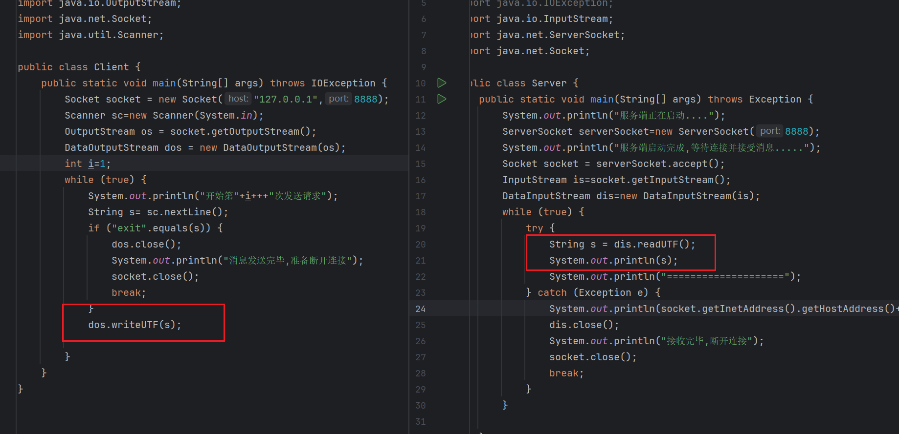

# 网络编程

## IP

```java
//API
//不用new
InetAddress
//获取IP
    //本地
    InetAddress.getName("localhost");
	InetAddress.getName("127.0.0.1");
	InetAddress.getLocaHost();

//DNS
InetAddress inet=InetAddress.getName("www.baidu.com");

inet.getHostName();
inet.getHostAddress();
```



## Port

TCP有80

UDP也有80

**单个协议下,端口号不能冲突**

```java
InetSocketAddress("IP",port);
.getAddress()
.getHostName()
.getPort()
```

端口划分



## UDP




### 客户端



### 服务端



### UDP多发,多收

启动多开功能



基于上面的代码添加一个循环



---

## TCP

### Client实现



```java
package com.lan.demo02TCP;

import java.io.DataOutputStream;
import java.io.IOException;
import java.io.OutputStream;
import java.net.Socket;

public class Client {
    public static void main(String[] args) throws IOException {
        Socket socket = new Socket("127.0.0.1",8888);
        OutputStream os = socket.getOutputStream();
        DataOutputStream dos = new DataOutputStream(os);
        dos.writeUTF("TCP连接测试~~");
        dos.close();
        socket.close();
    }
}

```

### Server实现



```java
package com.lan.demo02TCP;

import java.io.DataInput;
import java.io.DataInputStream;
import java.io.IOException;
import java.io.InputStream;
import java.net.ServerSocket;
import java.net.Socket;

public class Server {
    public static void main(String[] args) throws IOException {
        System.out.println("服务端正在启动....");
        ServerSocket serverSocket=new ServerSocket(8888);
        System.out.println("服务端启动完成,等待连接并接受消息.....");
        Socket socket = serverSocket.accept();
        InputStream is=socket.getInputStream();
        DataInputStream dis=new DataInputStream(is);
        String s = dis.readUTF();
        System.out.println(s);
        dis.close();
        System.out.println("接收完毕,断开连接");
        socket.close();
    }
}

```

### TCP多发多收

[流程讲解](https://www.bilibili.com/video/BV1Bp4y1E7sh?t=323.8&p=12)

用while包住原代码的这两句



## TCP多开

需要引入多线程

客户端不变

服务端代码

```java
package com.lan.demo02TCP2;

import java.io.IOException;
import java.net.ServerSocket;
import java.net.Socket;

public class Server {
    public static void main(String[] args) throws Exception {
        ServerSocket serverSocket = new ServerSocket(8888);
        System.out.println("服务端开启,等待连接.....");
                while (true) {
                    Socket socket = serverSocket.accept();
                    System.out.println(socket.getInetAddress().getHostAddress()+"上线了");
                    new ServerReaderThread(socket).start();
        }
    }
}

```

线程类代码

```java
package com.lan.demo02TCP2;

import java.io.DataInputStream;
import java.io.IOException;
import java.io.InputStream;
import java.net.Socket;

public class ServerReaderThread extends Thread {
    private Socket socket;
    public ServerReaderThread(Socket socket) {
        this.socket = socket;
    }
    @Override
    public void run() {
        try {
            InputStream is = socket.getInputStream();
            DataInputStream dis = new DataInputStream(is);
            while (true) {
                try {
                    String s = dis.readUTF();
                    System.out.println(s);
                } catch (Exception e) {
                    System.out.println(socket.getInetAddress().getHostAddress()+"下线了~~");
                    dis.close();
                    socket.close();
                    return;
                }
            }
        } catch (IOException e) {
            throw new RuntimeException(e);
        }
    }
}

```

