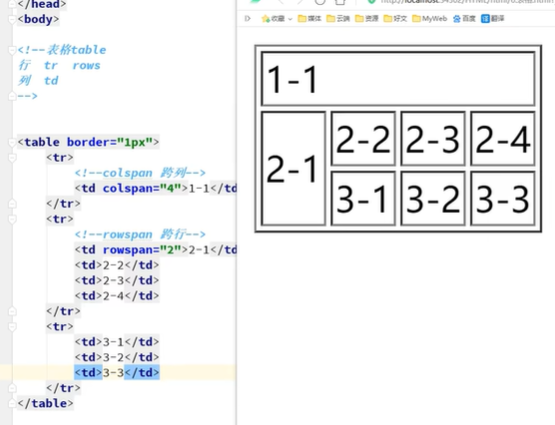
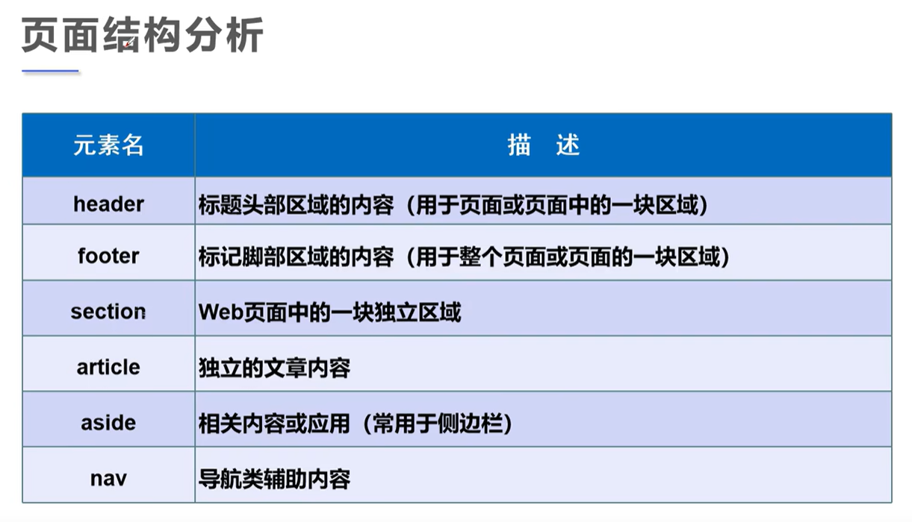
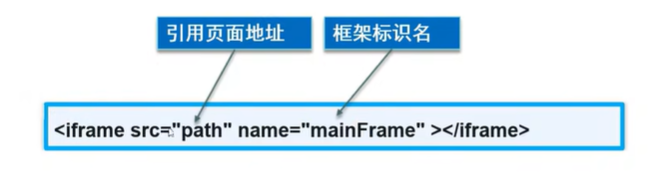
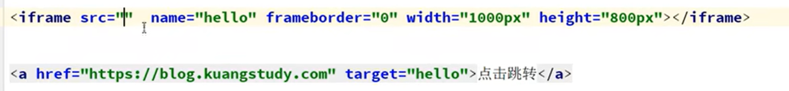
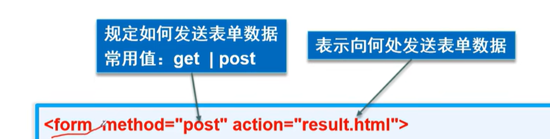
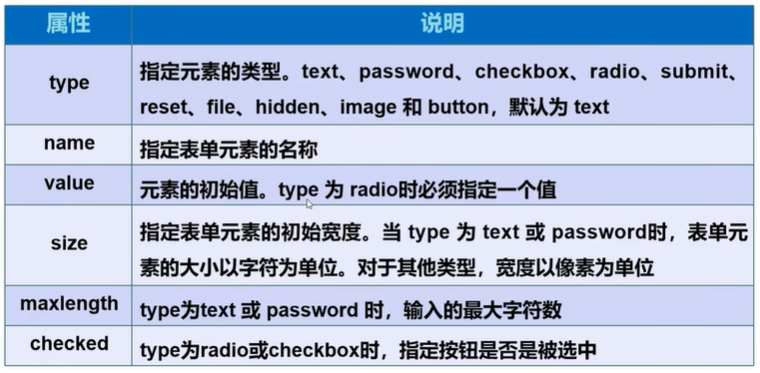
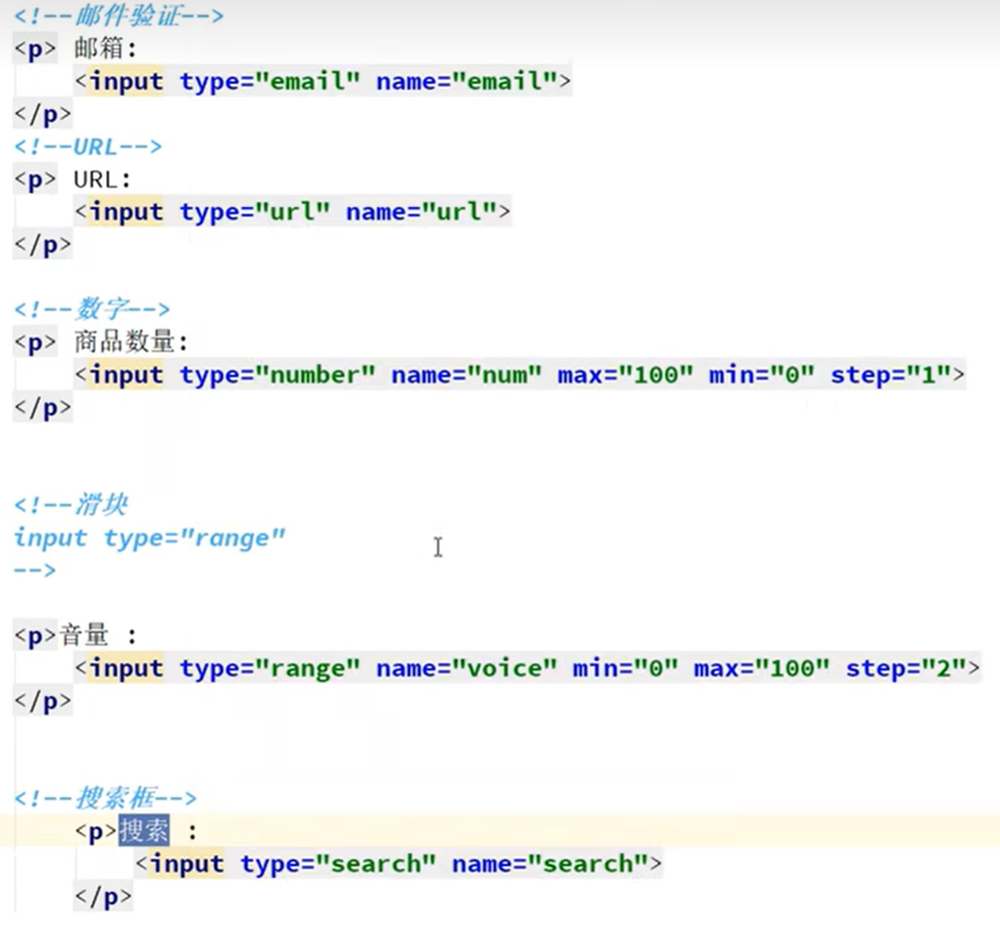

## 格式

```html
<!DOCTYPE html>
<html>
    
    <head>
        <mata>
        <title></title>
    </head>
        
     <body>   
     </body>
        
</html>
```

> <a>
>
> href,target
>
> [锚链接](https://www.bilibili.com/video/BV1x4411V75C?t=473.0&p=5)
>
> > [功能性链接](https://www.bilibili.com/video/BV1x4411V75C?t=569.5&p=5)
> >
> > QQ链接

> 快元素
>
> 行内元素

> 列表
>
> [自定义列表](https://www.bilibili.com/video/BV1x4411V75C?t=197.9&p=7)
>
> ```html
> <dl>
>     <dt></dt>
>     <dd></dd>
> </dl>
> ```

### 表格

> [table](https://www.bilibili.com/video/BV1x4411V75C?t=56.2&p=8)
>
> ```html
> <table>表格
>     <tr>行
>     <td>列</td>
>     </tr>
> ```
>
> 

#### colspan跨列

#### rowspan跨行



## 视频和音频

> **video(视频)**
>
> control
>
> autoplay
>
> **audio(音频)**

## 网站结构



header,footer,nav

## 内联框架！！

iframe

> src



[使用超链接跳转](https://www.bilibili.com/video/BV1x4411V75C?t=290.7&p=11)



# 表单

## form

> method(get|post)
>
> action



> **GET**:url中显示,不安全
>
> **POST**:可传输大文件,安全(但可进控制台->network查看请求包)

> ## **input的属性**
>
> 
>
> name表示组

> type="file"
>
> 上传文件

> **邮件**
>
> email
>
> **url**
>
> url
>
> **滑块**
>
> range

> **按钮type**
>
> button
>
> [*img* **(这也是按钮,等于submit)**](https://www.bilibili.com/video/BV1x4411V75C?t=258.2&p=14)
>
> submit	reset
>
> > value可赋默认值



### select

> option ->value,selected

## 只读,禁用,隐藏

readonly

disable

**hidden隐藏,但提交值还在**

## 表单初级验证

placeholder(提示信息)

required(非空判断)

pattern(正则判断)可直接搜索