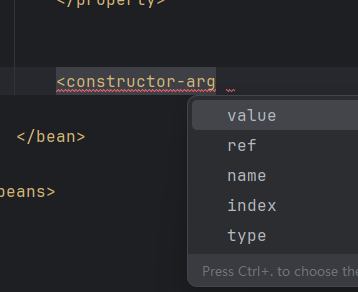
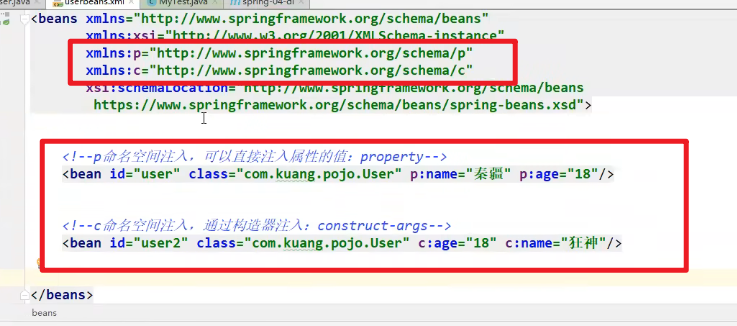
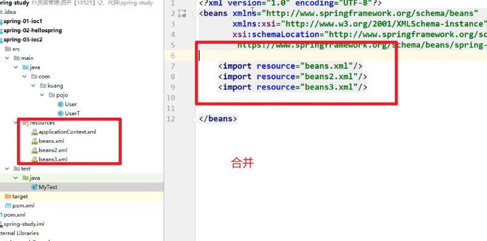
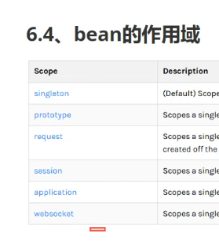
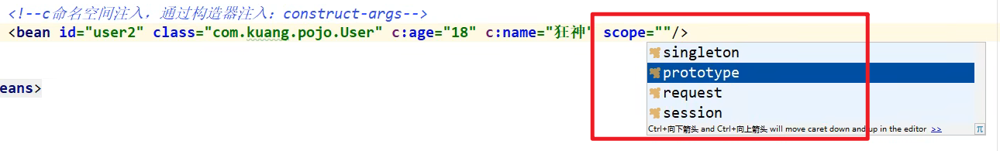
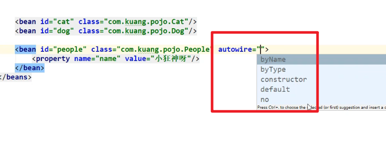
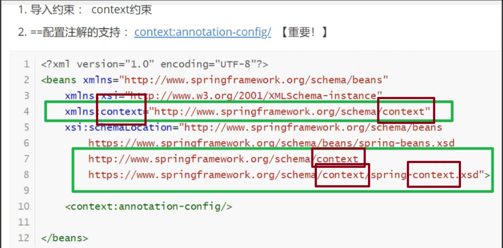
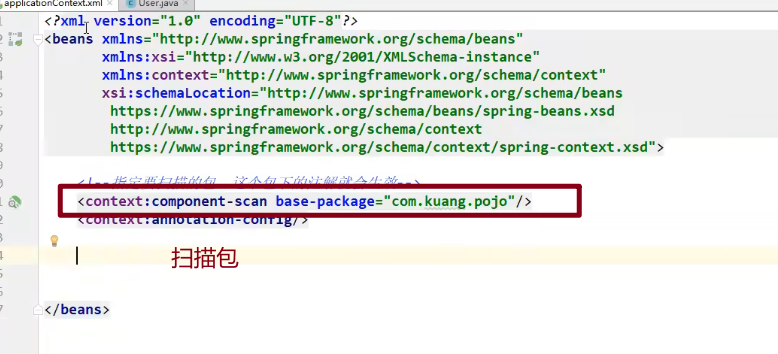

# IOC

## 依赖(容器)注入(对象)

### set注入

```java
public class Student {
    private int stuNo;
    private String name;
    private Address address;
    private String[] hobbies;
    private List<String> books;
    private Set<String> game;
    private Map<String ,String> grade;
    private String wife;
    private Properties info;
}
```

```xml
//applicationContext.xml
<bean id="address" class="com.lan.Address">
        <property name="city" value="fujian"/>
    </bean>

    <bean id="student" class="com.lan.Student">
        <property name="stuNo" value="001"/>
        <property name="name" value="lan"/>
        <property name="address" ref="address"/>

        
        
        
        
        <property name="hobbies">
            <array>
                <value>唱</value>
                <value>跳</value>
                <value>rap</value>
                <value>篮球</value>
            </array>
        </property>

        <property name="books">
            <list>
                <value>语</value>
                <value>数</value>
                <value>英</value>
            </list>
        </property>

        <property name="game">
            <set>
                <value>LOL</value>
                <value>王者</value>
                <value>吃鸡</value>
            </set>
        </property>

        <property name="grade">
            <map>
                <entry key="语文" value="90"/>
                <entry key="数学" value="95"/>
                <entry key="英语" value="60"/>
            </map>
        </property>

        <property name="wife">
            <value></value>
        </property>

        <property name="info">
            <props>
                <prop key="老师">李老师</prop>
                <prop key="同学">蔡同学</prop>
            </props>
        </property>


    </bean>
```

### 构造器注入

 


### c和p命名

> 导入约束:
>
> c是construct注入
>
> p是property注入




## 额外知识

### 别名

```xml
<alias>别名</alias>
等于<property></property>里的name属性
```

### 配置

导入



```java
        ApplicationContext context = new ClassPathXmlApplicationContext("applicationContext.xml","beans1.xml");
//可导入多个
```

---

## Bean的作用域



常用:

> singleton:(默认)
>
> new出来都是同一个

> prototype:
>
> 每次new都给新对象

其他都在web开发中用



## 自动装配

三种装配方式

> xml中显式配置
>
> java中显式配置
>
> **隐式自动装配**

### 配置文件自动装配

autowire



### 注解自动装配

导入约束



> @Autowired
>
> @Qualifier(value=" ")

> @Resource
>
> //新版JDK去掉@Resource了

## Spring注解开发



> @Component
>
> @Value("")

***注意***

> 其实@Controller/@Repository/@Service/@Component作用一样
>
> 只是
>
> dao层习惯用@Repository
>
> Service用@Service
>
> Controller用@Controller

**流行xml和注解结合注入**