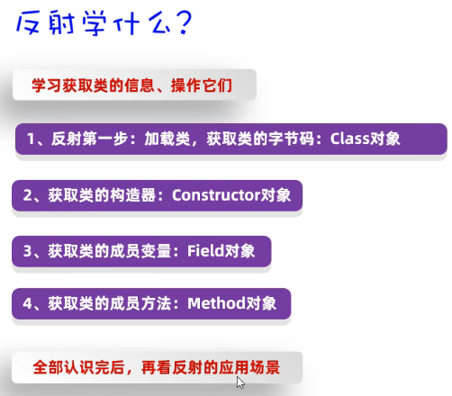
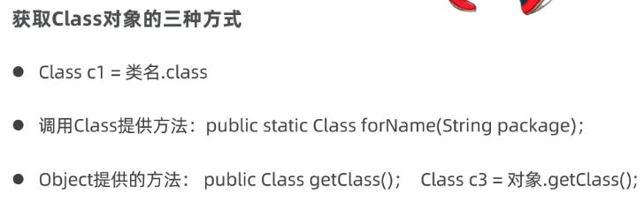
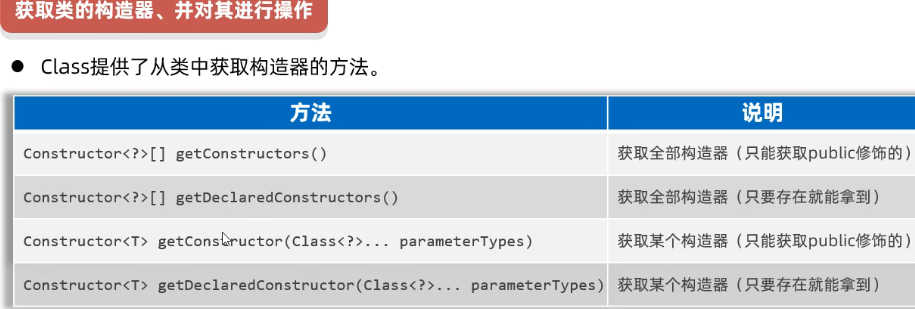
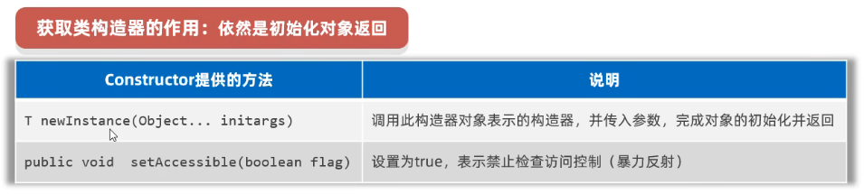
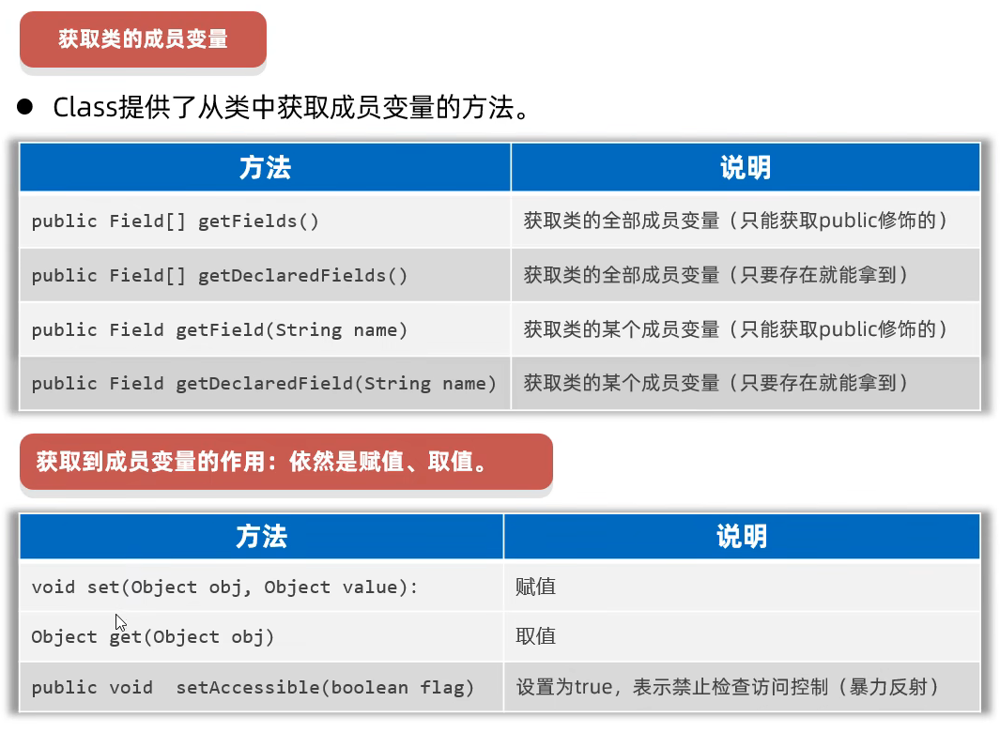
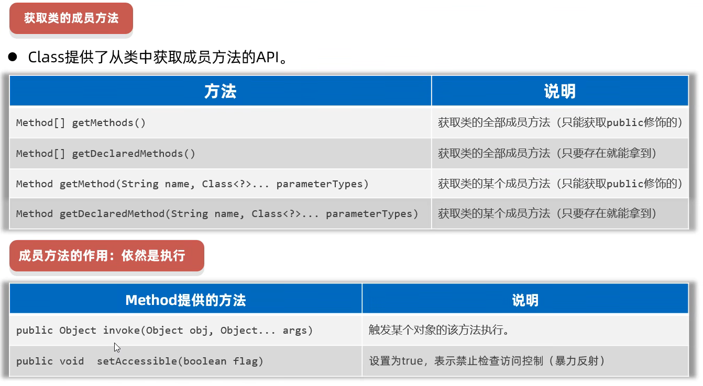

# 反射

[视频](https://www.bilibili.com/video/BV1DG4y1G7xy?t=4.4)

作用加载类

## 先学获取以下四个对象的方法



## 获取类



```java
Class c1 = Student.class;
sout(c1.getName());//包名.类名(全类名)
sout(c1.getSimpleName());//类名

Class c2 = Class.forName("#全类名(包名.类名)#");
//c1==c2;

Student s=new Student();
Class c3=s.getClass();
//c1==c2==c3;
```


## 获取构造器



```java
Class c = Student.class;

//获取构造器
//Constructor[] constructs=c.getConstructor();//基本不用,只能获取Public
Constructor[] constructs=c.getDeclaredConstructor();//全获取
constructs.for
    
//Constructor cons=c.getConstructor(参数);//这个也是只能拿Public的
Constructor cons=c.getDeclaredConstructor();
sout(cons.getName()+"--->"+cons.getParameterCount());
```

```java
//拿有参
Public Student(String name,int age){...}
Class s = Student.class;
Constructor c=s.getDeclaredConstructor(String.class, int.class);//一定要带.class!
```

## 获取构造器的作用



可以破坏封装

但是现在会抛异常

```java
Class s=Student.class;

        //获取构造器
        Constructor c1=s.getDeclaredConstructor();


            Student s2=(Student) c1.newInstance("name","age");
//**********************************
		//调用前取消才有用
            c1.setAccessible(true);//不检查访问权限
//**********************************
            System.out.println(s.toString());
```

## 获取和使用成员变量



[视频](https://www.bilibili.com/video/BV1DG4y1G7xy?t=10.0&p=5)

## 获取和使用成员方法




---

## [反射的作用](https://www.bilibili.com/video/BV1DG4y1G7xy?t=122.1&p=6)

> 得到一个类的全部成分
>
> 破坏封装性
>
> 做框架