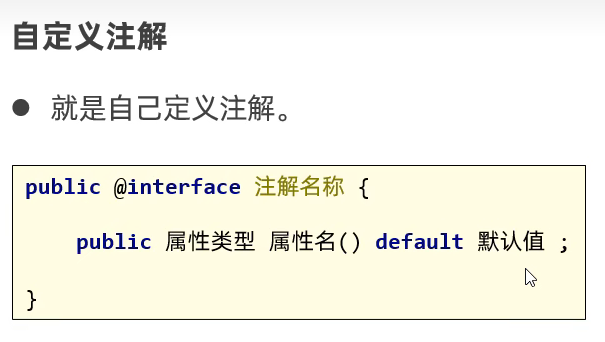
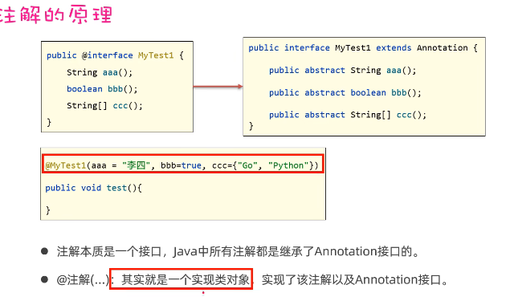
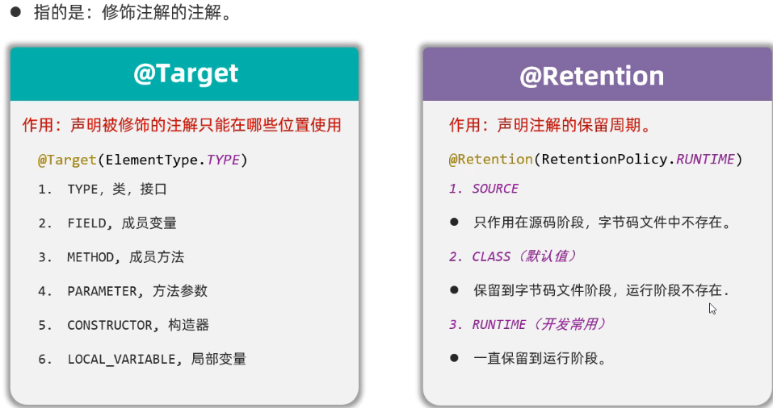
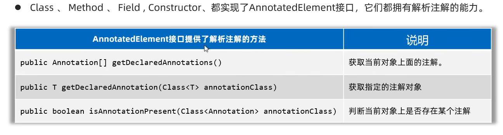

# 注解

[视频](https://www.bilibili.com/video/BV1DG4y1G7xy?t=182.6&p=7)

## 自定义注解

 

特殊属性名:	value

只有value属性时可以不写	"value="

> 原理
>
> 

## 元注解

> @Target
>
> @Retention
>
> 

## 注解的解析

##先获取注解对象(类,方法,变量...),才能定位到注解

