# 基础操作

mkdir

rm	rf	文件

ls/ll

pwd/cd

cp/mv 	rf	文件1	文件2

## 归档

> 备份(体积较大)

tar	-cvf	**文件.tar**	文件(夹)[可多个]

解压

tar	-xvf	压缩文件.tar	-C	解压位置

> 归档并压缩

tar	-c**z**vf	**文件.tar.gz**	文件(夹)[可多个]

tar	-x**z**vf	压缩文件.tar.gz	-C	解压位置

## 软链接(link)

> ~=快捷方式

ln	-s	文件	快捷文件

(没-s默认是硬链接)

## 添加用户

sudo	useradd	-m	用户名

(ls	/home)

设置密码

sudo	passwd	用户

### 删除用户

sudo	userdel	用户

## 用户组

> 创建组
>
> groupadd	组名

> 创建并添加用户
>
> useradd	-m	-g	组名	成员

> 修改用户所在组
>
> usermod	-g	组名	用户

### 查看

cat	/etc/group

cat	/etc/passwd

### 以root登入

```bash
su root

gedit /etc/pam.d/gdm-autologin
#加注释
#auth	required	pam_succeed_if.so user!=root quiet_success

gedit /etc/pam.d/gdm-password
#auth	requiredpam_succeed_if.so user !=root quiet_success

重启

从"未列出"登入
```

## 文件权限

r w x : 读,写,执行

421

作者 | 组 | 所有人

### 修改权限

chmod	([u/o/a]) [+-] [rwx]	文件

可以不加u/o/a

---

### 修改所属用户

**opt**算公共文件夹

chown	-R	用户	文件路径

-R是递归

---

## 可执行脚本

### 常见脚本

> Shell脚本	*.sh
>
> Perl脚本	*.pl
>
> Python脚本	*.py

> 等效写法
>
> ./hello.py
>
> /bin/python3	hello.py

### 创建shell脚本

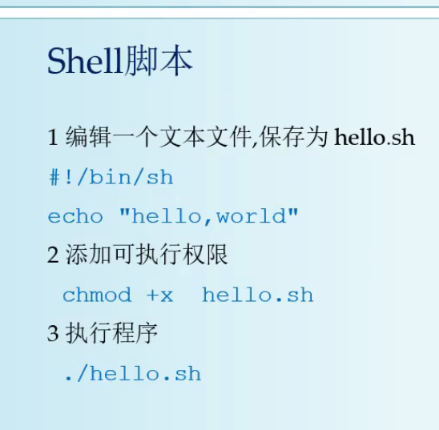

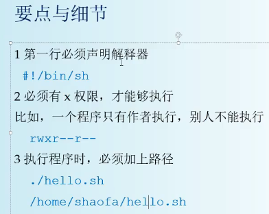

其他脚本差不多

---

## Shell中的变量

shell语法在[shell](C:\Users\1\Desktop\note\002其他\speed\note\sehll.md)

```shell
#! /bin/sh

NAME=/opt

ls	${NAME}
```

## 环境变量

***以下是配置一个临时环境变量,只对当前终端环境有效***

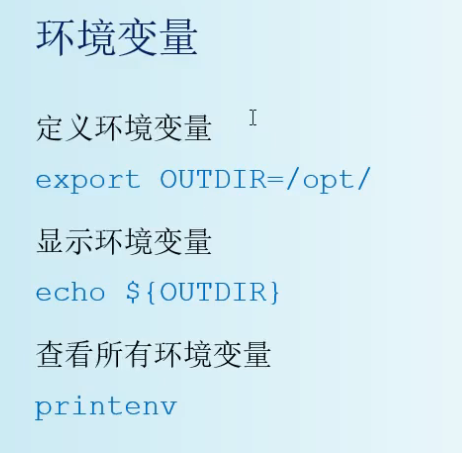


## 用户环境变量

将变量定义在

~/.profile

(centOS是~/.bash_profile)

**对当前用户有效**

> 在文件最下使用export定义
>
> ```shell
> export JAVA_HOME=/opt/jdk1.8
> ```

## 系统环境变量

对所有用户有效

> 定义在/etc/profile文件中
>
> **但以root修改/etc/profile.d**

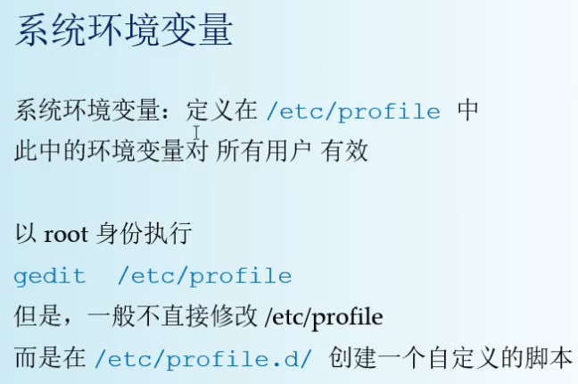

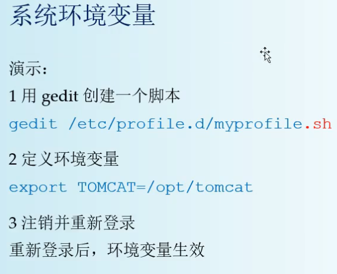

# PATH环境变量

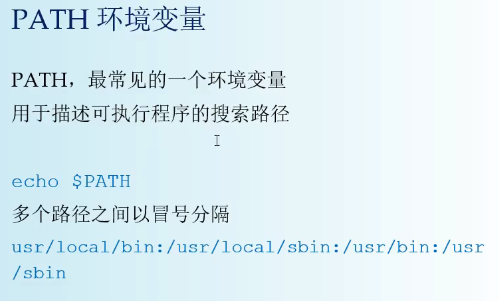

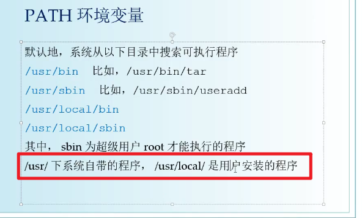

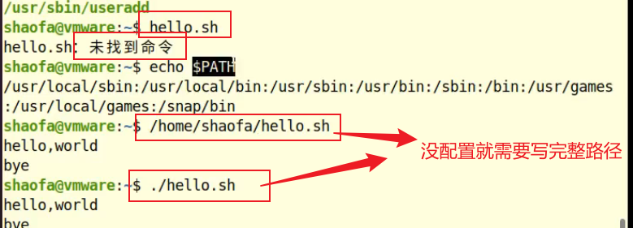

定义格式

> 以冒号分隔,所以是添加一个


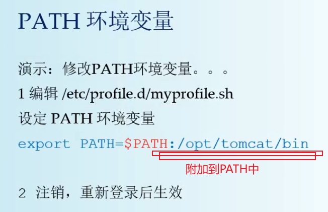

## 手动配置网络

> ifconfig
>
> netstatus

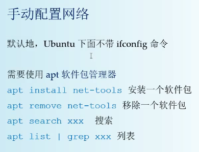

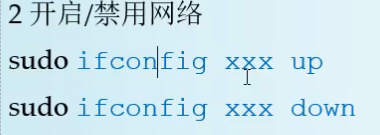

```bash
sudo ifconfig ens33 up/down
```

## 传输文件

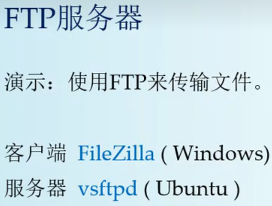

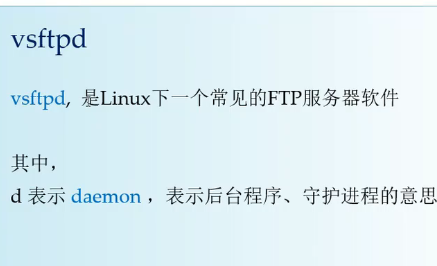

```bash
sudo su
ls /usr/sbin/vsftpd
apt install vsftpd
```

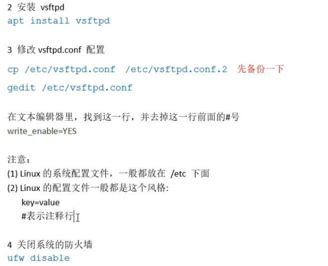

启动服务

```bash
service vsftpd start
```


## 防火墙

Linux系统自带防火墙一般不用

一般自行配置(**不能把所有都阻止**)

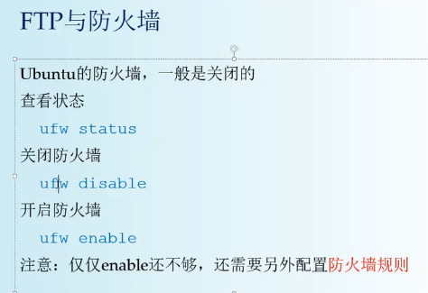


[原理讲解](https://www.bilibili.com/video/BV1na4y1773c?t=389.6&p=41)

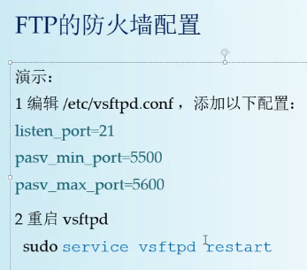

## SSH服务

XShell工具

先安装服务

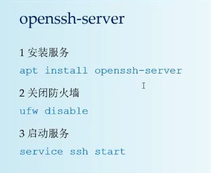

```shell
ls /etc/init.d
#包含各种服务的脚本
```

### 查找安装删除软件包的名字

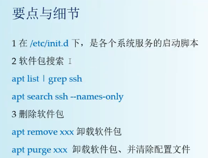

## 文件上传

Windows和Linux文件末尾换行符有差异,需转换

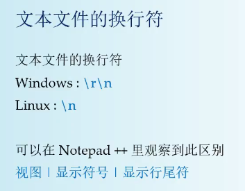

可以使用notepad++转换(***shell脚本需转换***)

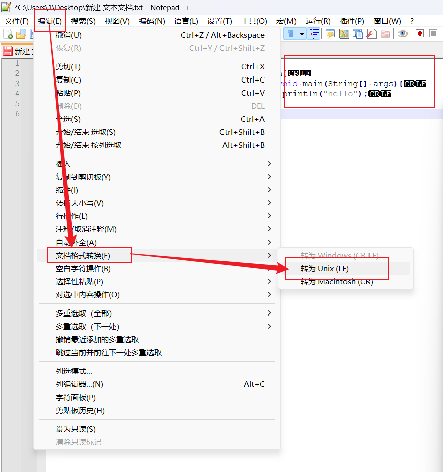

# java

默认放在/usr/bin下

不用配PATH

---

Export导出成 jar file

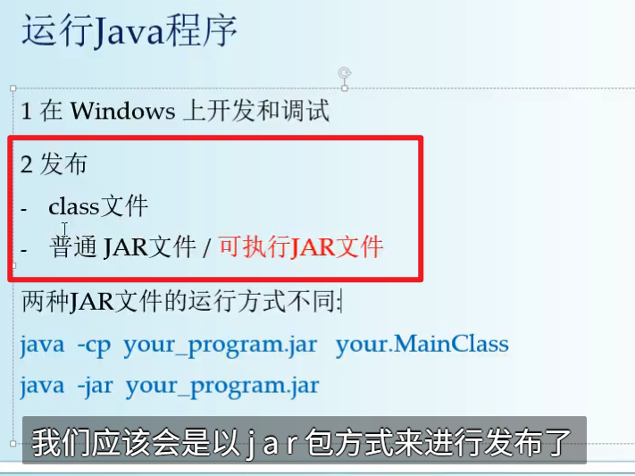

两种方式分别是:

普通jar包和可执行jar包

---

## 创建运行脚本

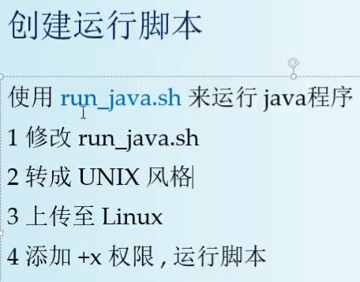

脚本格式

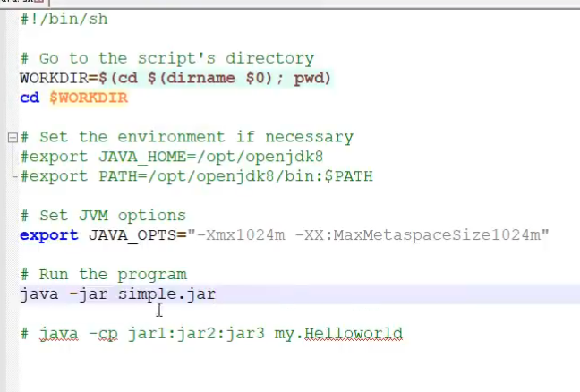