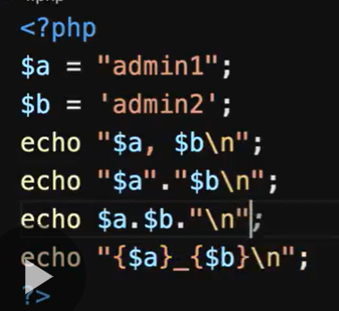
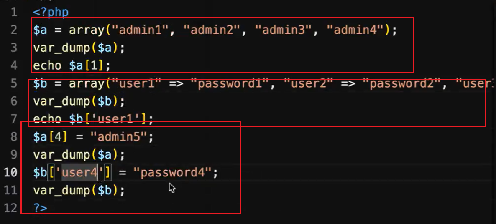
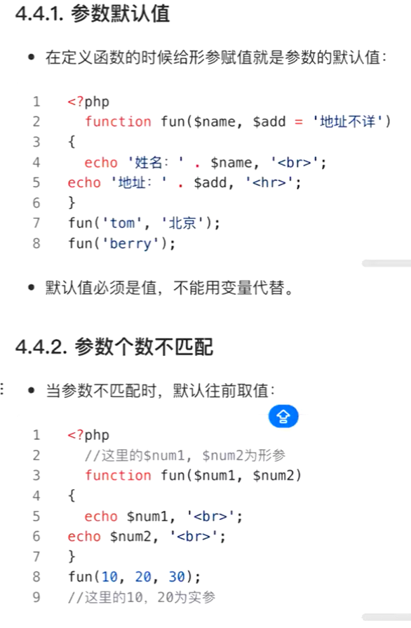
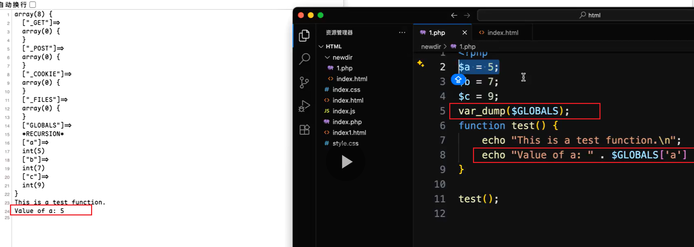
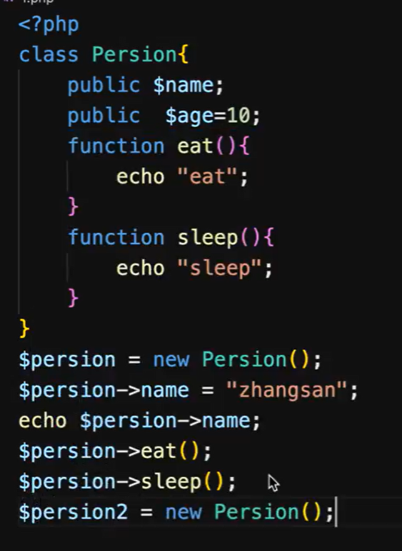

# PHP

```php
echo "$a";	//输出a的值
echo '&a';	//输出&a
```



### 数组



> 遍历
>
> ```php
> <?
>     foreach($a as $key => $value){
>     echo "$key";
>     echo "$value";
> }
> ?>
> ```
>
> 

### 函数

```php
<?php
    function 函数名(参数){
    
    return ;
}
```

**函数可赋值给变量**






### 类的定义



