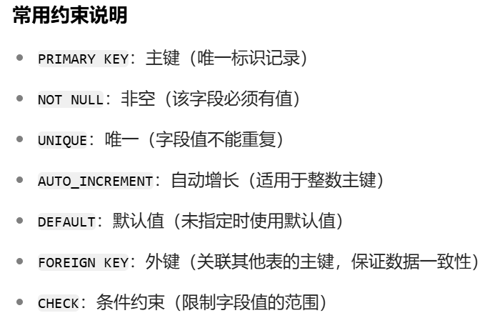

# MySQL

```mysql
show databases;
show table;
```


> 库
>
> ```mysql
> create database 数据库的名字;
> 
> create database if not exists 数据库的名字;
> 
> drop database 数据库名字;
> 
> drop database if exists 数据库名字;
> ```

> 表
>
> ```mysql
> create table 表名(
> 	id INT(2) not null,
>     name varchar(255)
> );
> 
> 示例:
> -- 创建主表（部门表）- 用于演示外键关联
> CREATE TABLE departments (
>   dept_id INT PRIMARY KEY AUTO_INCREMENT,
>   dept_name VARCHAR(50) NOT NULL UNIQUE
> );
> 
> -- 创建示例表（员工表）- 包含多种约束
> CREATE TABLE employees (
>   -- 主键+自增约束：唯一标识，自动增长
>   emp_id INT PRIMARY KEY AUTO_INCREMENT,
>   
>   -- 非空约束：必须填写
>   emp_name VARCHAR(50) NOT NULL,
>   
>   -- 唯一约束：确保手机号不重复
>   phone VARCHAR(20) UNIQUE,
>   
>   -- 检查约束：年龄在18-65之间
>   age INT CHECK (age >= 18 AND age <= 65),
>   
>   -- 检查约束+默认值：性别只能是男/女/保密，默认保密
>   gender VARCHAR(2) DEFAULT '保密' CHECK (gender IN ('男', '女', '保密')),
>   
>   -- 非空+默认值：入职日期默认为当前时间
>   hire_date DATE NOT NULL DEFAULT (CURRENT_DATE),
>   
>   -- 外键约束：关联部门表的dept_id
>   dept_id INT,
>   FOREIGN KEY (dept_id) REFERENCES departments(dept_id)
>     ON DELETE SET NULL  -- 部门删除时，员工的部门字段设为NULL
>     ON UPDATE CASCADE,  -- 部门ID更新时，员工的部门ID同步更新
>   
>   -- 唯一约束（联合字段）：同一部门内员工编号不能重复
>   emp_no VARCHAR(20),
>   CONSTRAINT uk_dept_empno UNIQUE (dept_id, emp_no)
> );
> 
> ```
>
> 
>
> ```mysql
> insert into 表名(字段名1,字段名2,字段名3....字段名n) values(值1,值2,值3....值n),(值1,值2,值3....值n);#可null
> 
> delete from 表名 [where 条件];
> 
> update 表名 set字段名1=字段值1,字段名2=字段值2....字段名n=字段值n [where条件];
> 
> 
> select *
> from Mysql.表名(跨库查询)
> where ;
> 
> select*fromuser limit 2;
> ```
>
> 

## 内置数据库

## information_schema(重点库)


## 内置函数

concat()

group_concat()