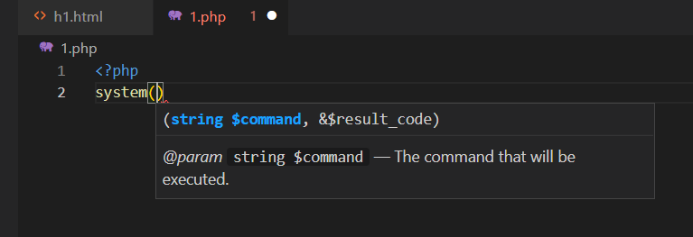
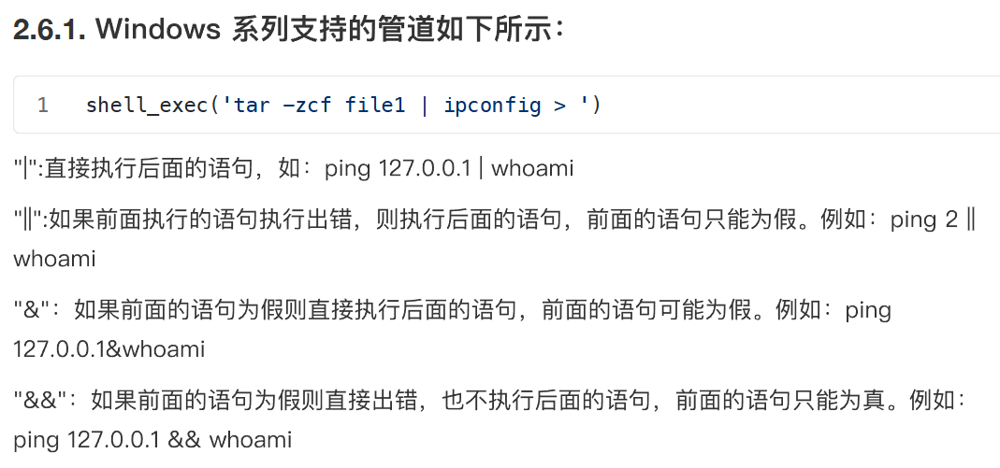
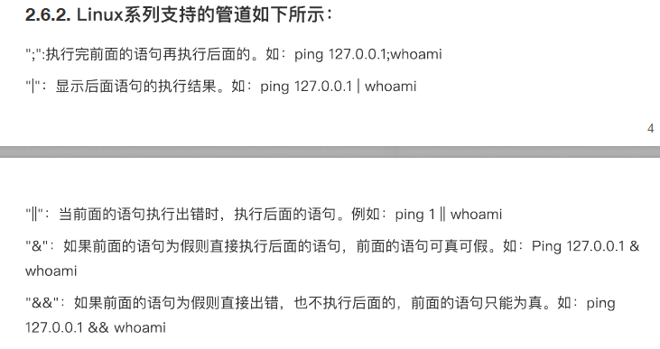
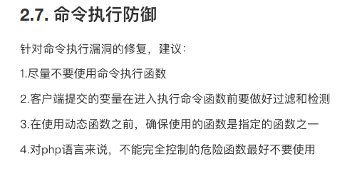
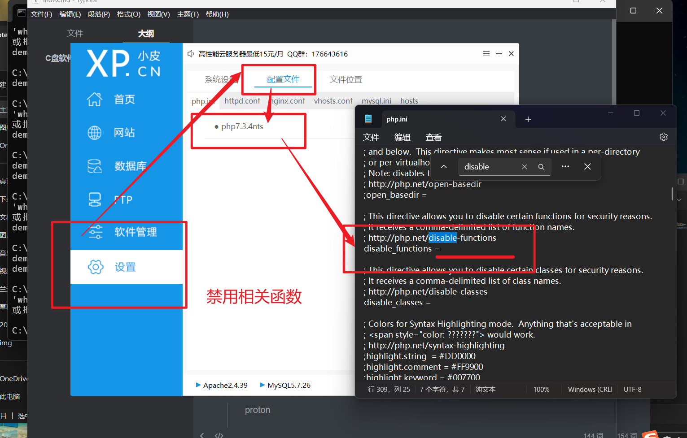
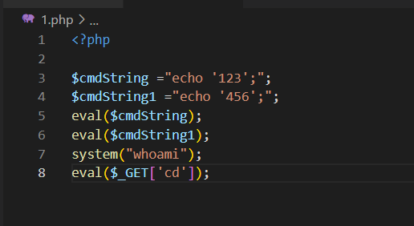
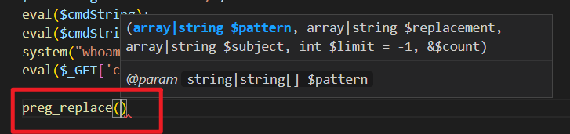
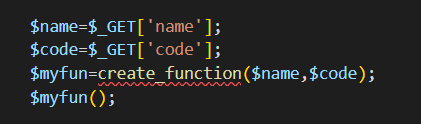
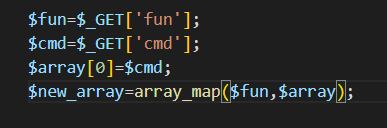

# RCE远程命令执行


## 命令执行函数

有些命令可以执行shell命令

参数疑问可在code中确认



## 拼接问题

防止会与前面的语句拼接,可能需要使用管道符"|"等符号拼接



Linux



## 防御



2,php配置文件可禁用



# RCE远程代码执行

命令执行的是系统函数命令

"代码"执行的是php函数命令

## eval()内嵌代码



还有assert();

## preg_replace()正则

php7版本以上无法使用



## create_function()

> $myfun=create_function($name,$code);
>
> 那么会有返回值

> create_function($name,$code);
>
> 会直接执行$code



## array_map()回调函数



```php
$array中的每一个值都会作为
$fun函数的参数传入处理
然后返回赋值给
    $new_array
```

## 文件查看相关命令

> cat|tac|head|tail|more|less|nl|sort|uniq|od|xxd|hexdump|base32|base64|strings|grep|file|find|cp|mv|ping|curl|echo|wget|nc|ncat|sed|\?|\*|$|