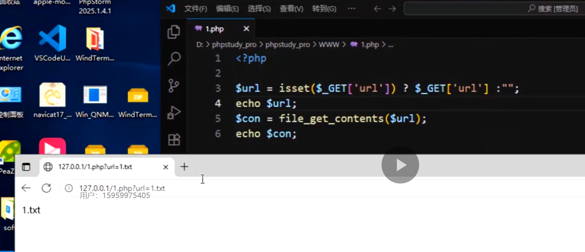
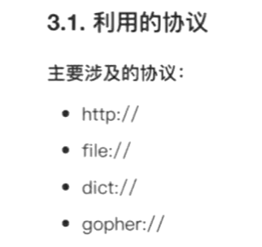

# SSRF

web服务器对后端服务器的访问限制没做好,使得web服务器可以读取敏感数据


后端尝试的php代码

前端搜索栏中,可对file_get_contents();传递URL参数,比如 **https://www.baidu.com**






```php
curl
file_get_content
    
#这两个函数常可触发这个漏洞
```


直接扫端口号之类的,因为有一些会回显版本信息


gopher协议

类似www


