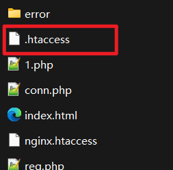
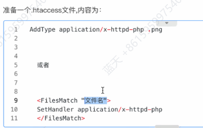

# 文件上传漏洞

## Pass-02

### MIME类型

位于请求头的content-type中

后端代码对文件类型的控制就是通过content-type中的参数

## Pass-03

黑名单方式

绕过:找不在黑名单中的脚本类型

Apache配置文件中添加黑名单

突破口就是网站中的这个分布式配置文件

## Pass-05

利用Windows不区分大小写的特点(Linux区分大小写)

