# git

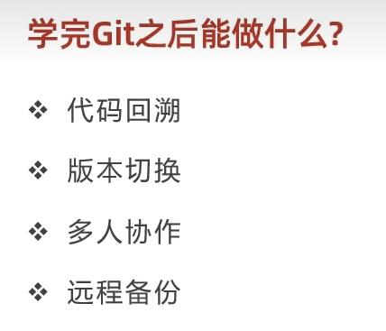


命令行是最常用的方式

**常用git命令**


## 获取git仓库

01本地初始化

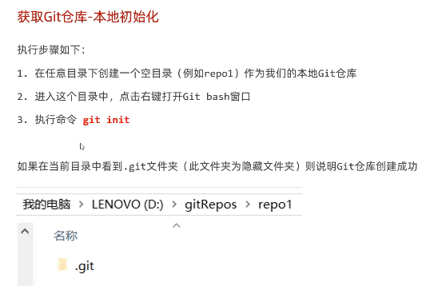


02远程仓库克隆


注意事项:

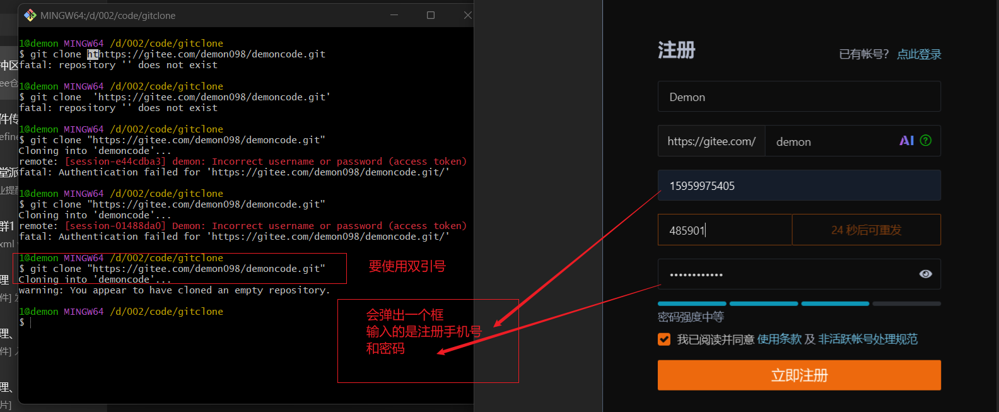

## 基本概念

```git
git status
git add
#git reset 
git commit -m "注释操作内容"
git log
```


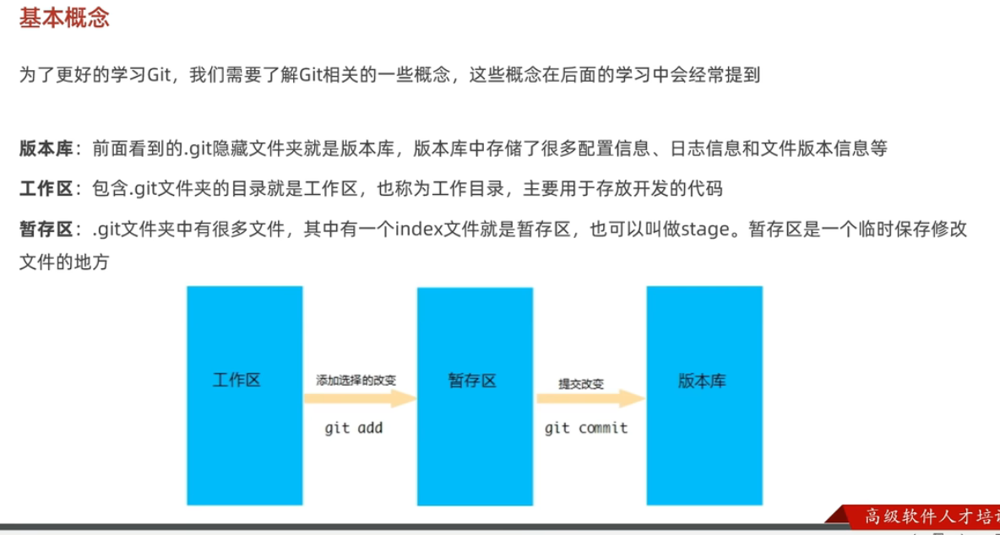

### 版本库:

.git文件

### 工作区:

.git同级目录

放开发代码

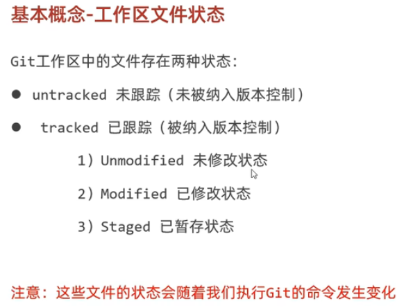

使用**git status**查看

### 暂存区

文件只要被提交**一次**,然后被跟踪

就可以**直接** **commit** (会覆盖)

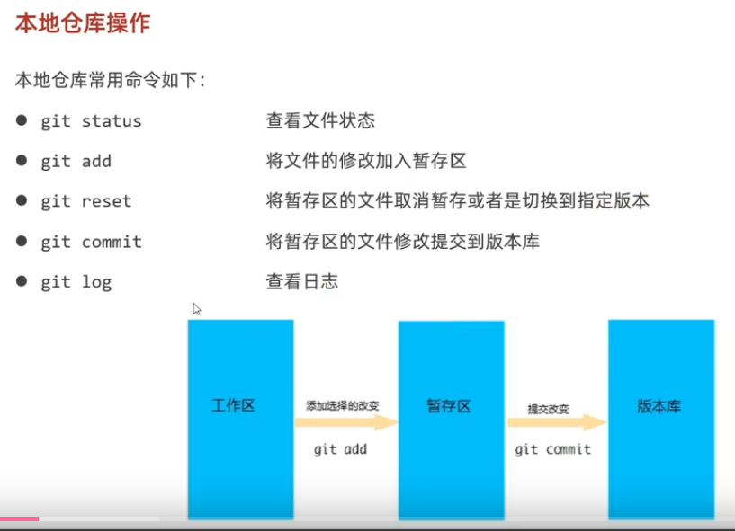

## 回退版本

```git
git reset --hard 版本号
```

---

## 操作远程仓库

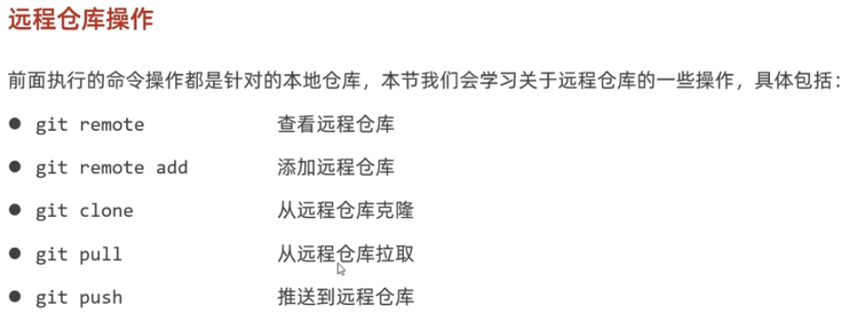

```git
git remote -v
```

### 本地仓库关联远程仓库

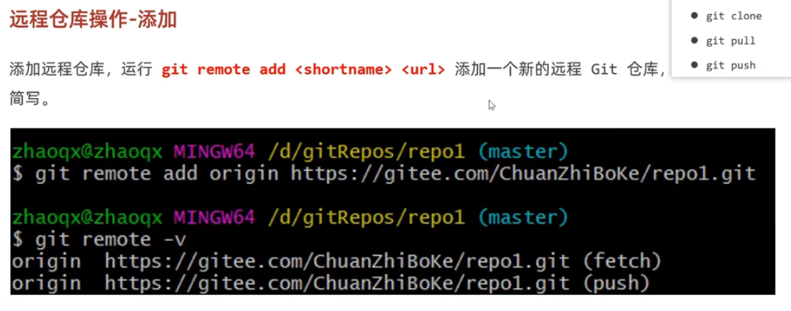

### 推送

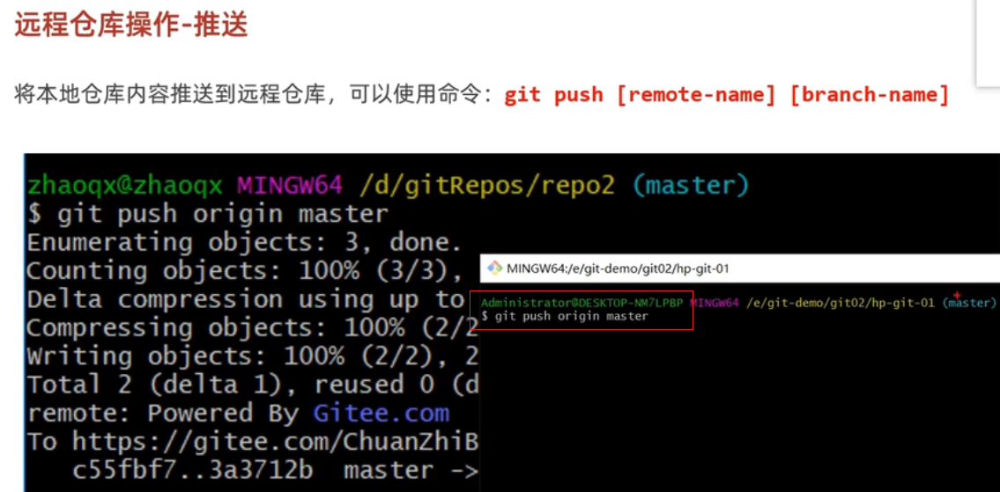

### 克隆+拉取(pull)

克隆(clone)是第一次关联仓库时的执行的(**只有一次**)

后续想要更新仓库用的是 **git pull 别名 分支** 命令

```bash
# 强制拉取并覆盖本地更改
git fetch --all
git reset --hard origin/master
```


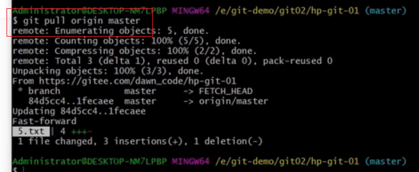

---

## 分支

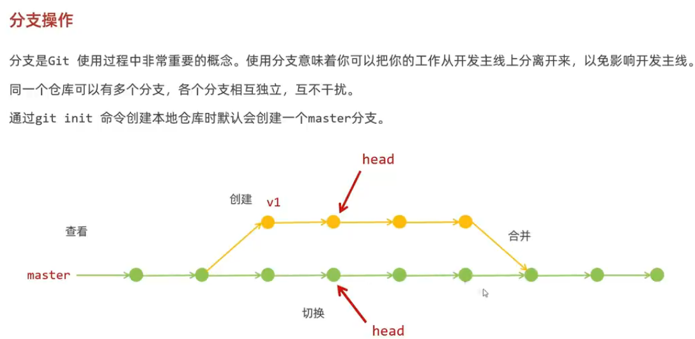

### 命令

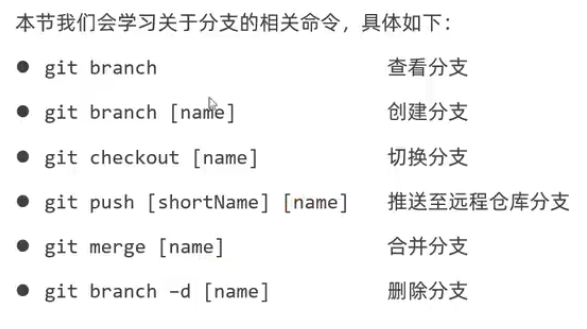

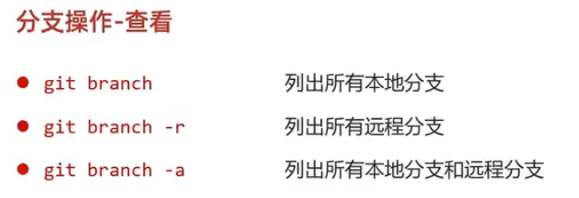

## 标签

快照

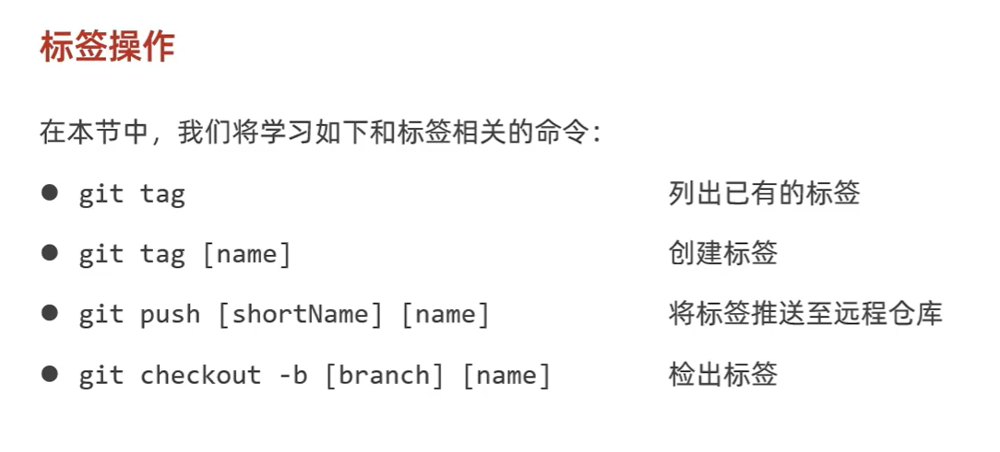

# IDEA中配置Git

记得退出工程,在 all setting 中配置

点击 **Test** 后出现版本号就配置成功了

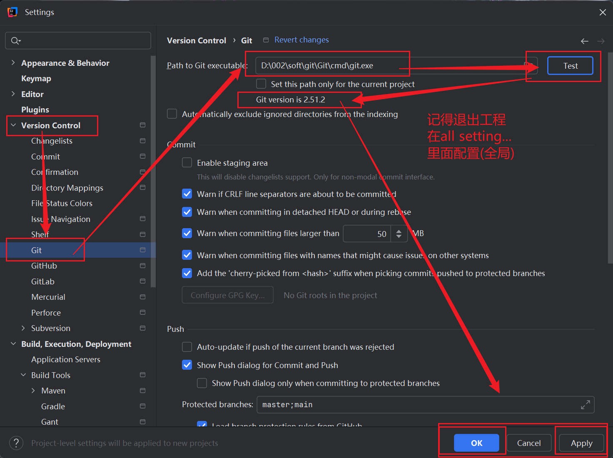

### 配置本地仓库

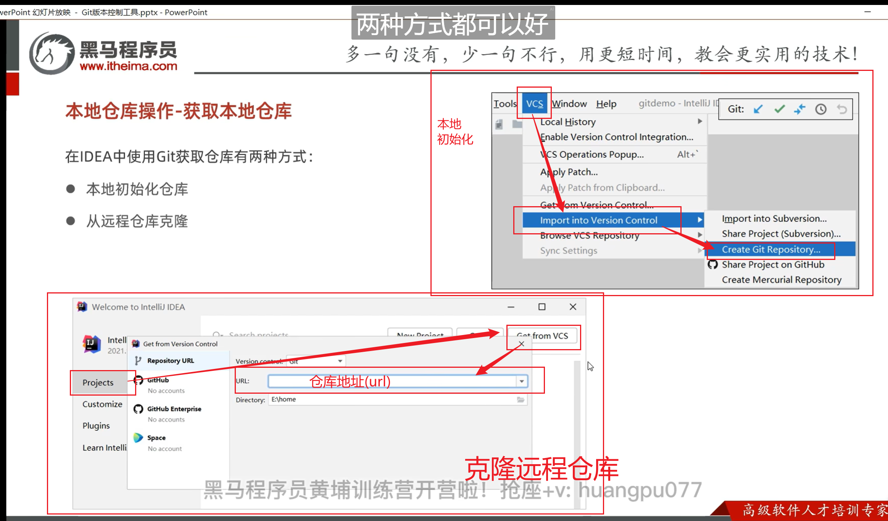

### 同步代码

注意:

​		选择仓库文件的时候是在 **选中目录下一级** 创建的 .git文件

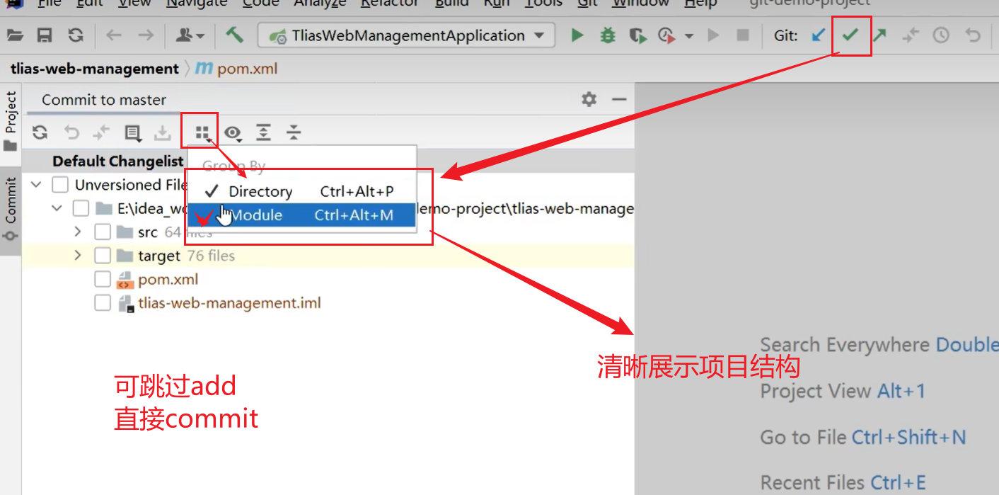

### .gitignore

文件名称固定,定义哪些文件默认不提交

(一般提交 **src** 和 **配置文件**)

**与src文件同级**

内容:

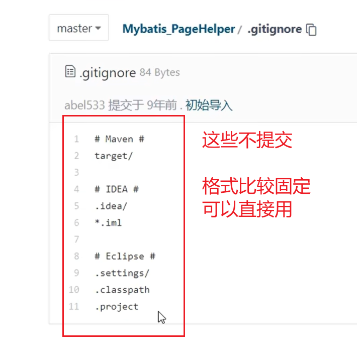

或者

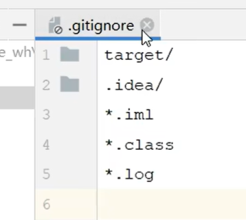


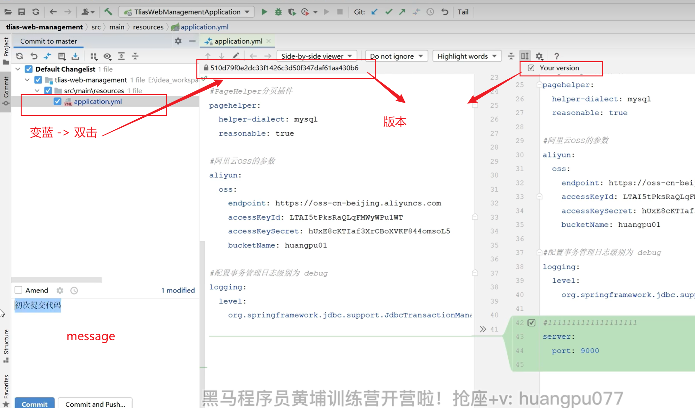


### 版本信息

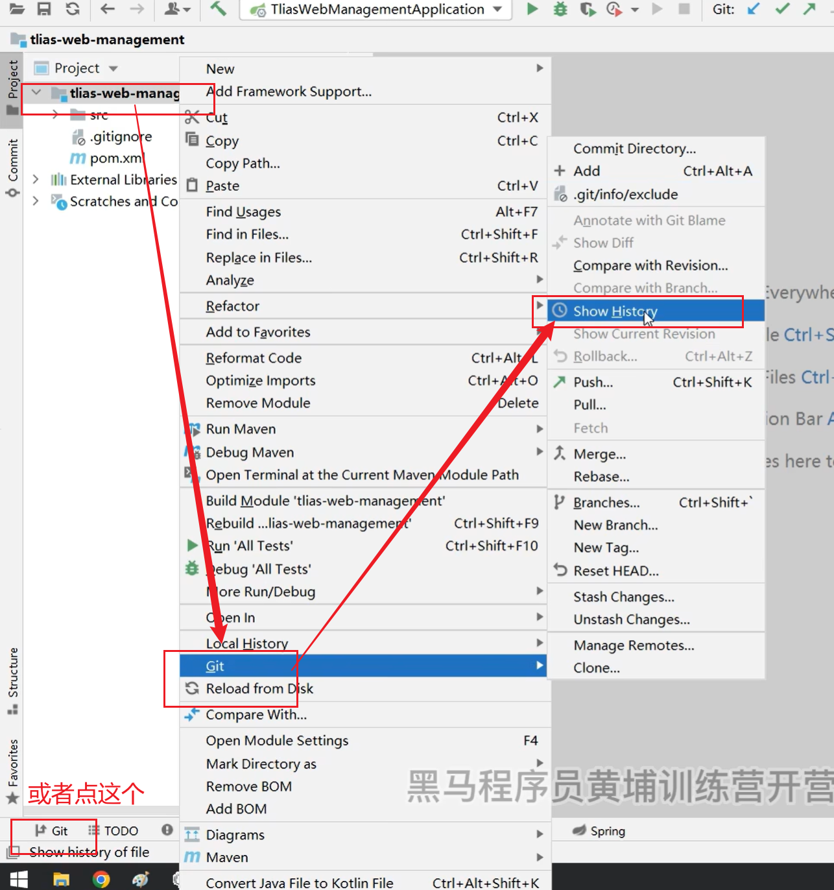

### IDEA远程仓库

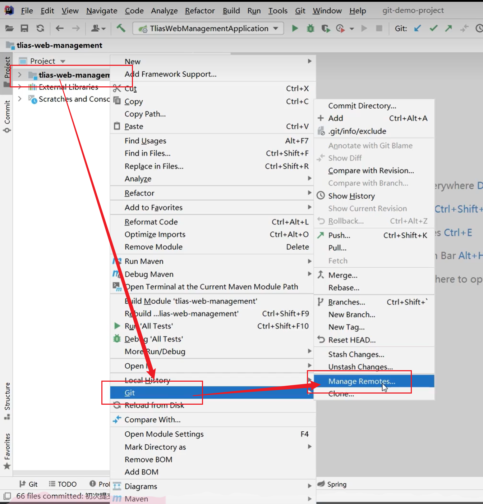

### 分支操作

---

## 冲突问题

同时操作同一段代码造成