# docker

## docker下载

Linux下载安装docker环境(Ubuntu为例)

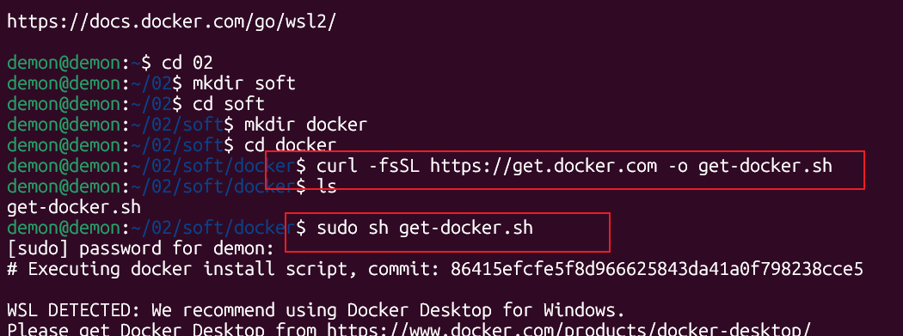

```bash
docker -v


# 下载安装脚本
curl -fsSL https://get.docker.com -o get-docker.sh

# 执行安装
sudo sh get-docker.sh


docker images 	#查看是否安装成功(连接到守护进程(开启))

#没有
systemctl status docker
systemctl start docker
systemctl enable docker
systemctl restart docker

```

[详细apt安装](..\note\006docker - 练习.md##docker安装详细)

## 关于systemctl

```bash
#关于systemctl
systemctl list-unit-files | grep [redis/docker...]#查看此别名的服务的真实名称

# 查看 redis 服务的详细信息，找到它链接到哪里
systemctl status redis
# 或者
systemctl cat redis

# 在 systemd 目录中查找 Redis 服务文件
sudo find /etc/systemd/system /usr/lib/systemd/system -name "*redis*" -type f
```


## docker有问题时重新安装

```bash
# 卸载有问题的Docker仓库
sudo rm -f /etc/apt/sources.list.d/docker.list

# 使用官方脚本安装
curl -fsSL https://get.docker.com -o get-docker.sh
sudo sh get-docker.sh
```


**权限问题**：安装后记得将用户添加到 docker 组，否则需要一直使用 sudo

安装docker compose

```bash
# 下载最新版本的 Docker Compose
sudo curl -L "https://github.com/docker/compose/releases/latest/download/docker-compose-$(uname -s)-$(uname -m)" -o /usr/local/bin/docker-compose

# 添加执行权限
sudo chmod +x /usr/local/bin/docker-compose

# 验证安装
docker-compose --version
```


## 镜像源

[阿里云](https://www.aliyun.com/)

### 目前可用镜像源(2025/11/05)

```bash
docker.1ms.run
docker-0.unsee.tech
docker.hlmirror.com
docker.m.daocloud.io
hub.rat.dev
```


详细获取步骤

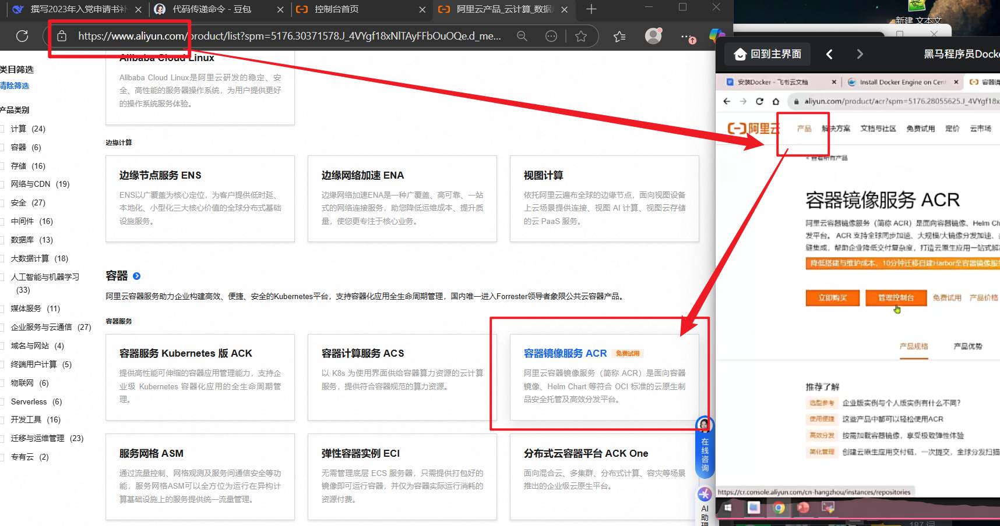

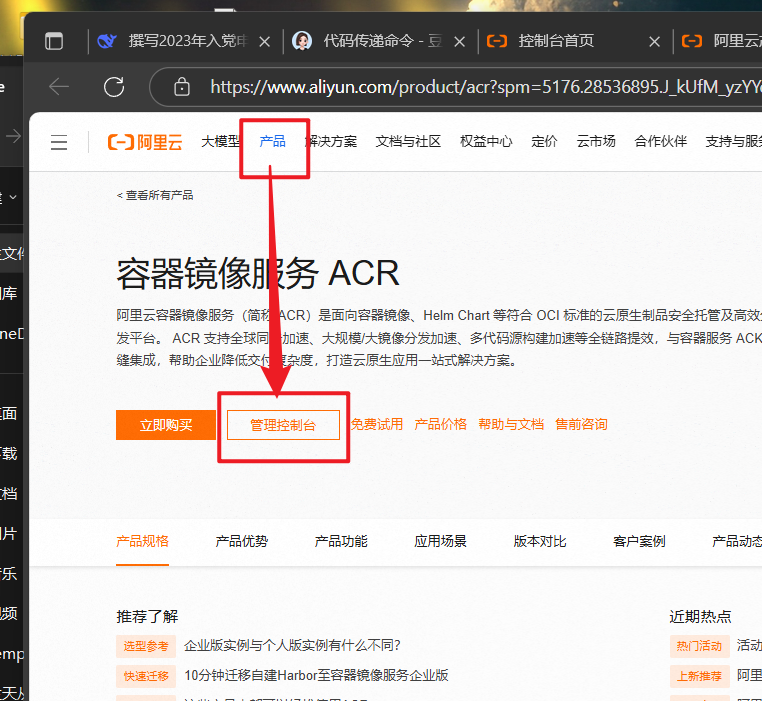

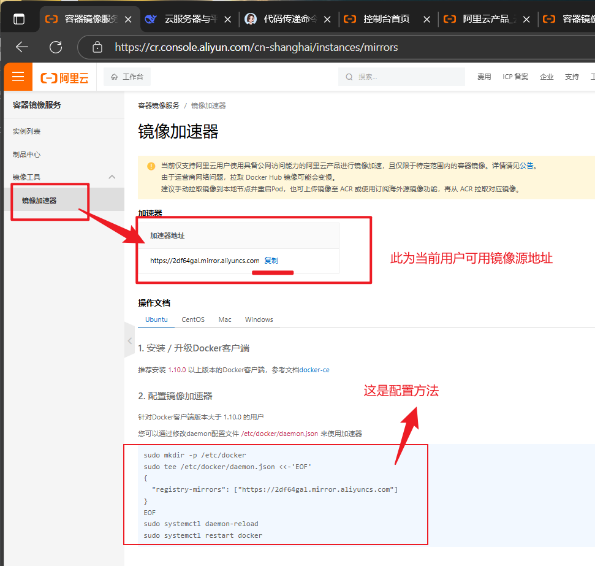

创建目录 ->创建配置文件并加入镜像源地址 ->加载守护进程 -> 重启docker


配置镜像源

```bash
1. 创建或编辑 Docker 配置文件
sudo mkdir -p /etc/docker
sudo nano /etc/docker/daemon.json


2. 添加国内镜像源
{
  "registry-mirrors": [
    "https://registry.cn-hangzhou.aliyuncs.com",
    "https://docker.mirrors.ustc.edu.cn",
    "https://hub-mirror.c.163.com"
  ]
}

3. 重启 Docker 服务
sudo systemctl daemon-reload
sudo systemctl restart docker

4. 检查配置是否生效
sudo docker info
```

```bash
# 1. 停止 Docker 服务
sudo systemctl stop docker

# 2. 配置镜像加速器
sudo tee /etc/docker/daemon.json <<EOF
{
  "registry-mirrors": [
    "https://registry.cn-hangzhou.aliyuncs.com",
    "https://docker.mirrors.ustc.edu.cn",
    "https://hub-mirror.c.163.com"
  ]
}
EOF

# 3. 重启 Docker 服务
sudo systemctl daemon-reload
sudo systemctl start docker

# 4. 验证配置
sudo docker info | grep -A 10 "Registry Mirrors"

# 5. 测试下载
sudo docker pull nginx
```


##**镜像可以用Windows类比,就是安装包双击安装后下载的一堆直接可运行文件**##


---

## 部署服务

MySQL为例

> 此为要一行 "**\\**" 是用来换行的

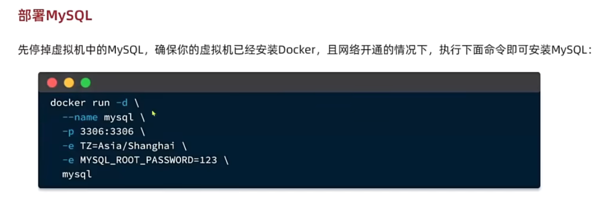

一次下载多次运行,和软件多开一样

## 命令


```bash
-d 是后台运行
--name 取名字
-p 端口映射 [真实地址:容器虚拟地址]

##
-e 格式:KEY=VALUE [设置环境变量]
##这个参数有几个要看官方文档

镜像名字(这里是mysql)
格式[镜像名repository:版本tag]
#没写版本默认最新
```

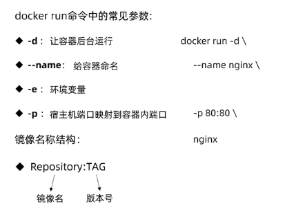

# docker基础

## 常见命令

**命令过程,要能手绘**

[讲解](https://www.bilibili.com/video/BV1HP4118797?t=32.8&p=5)

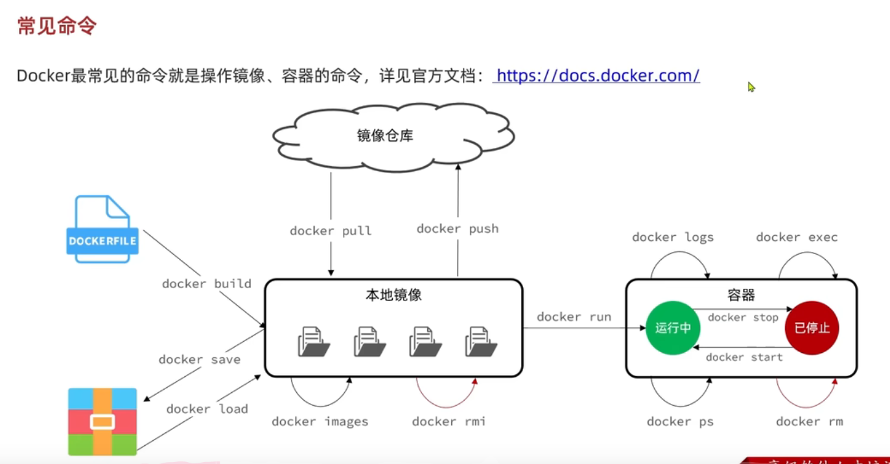

```bash
docker logs
docker exec
```

[练习](../006docker练习.md)


```bash
docker pull
docker images
docker save -o
docker rmi
docker load -i
#不知道的都可以用--help

#查看日志 加 -f 变实时查看
docker logs -f
```

### 进程输出格式化

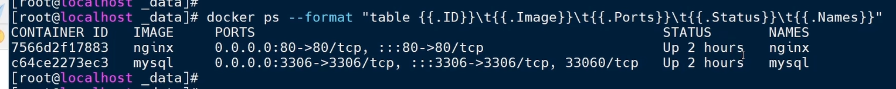

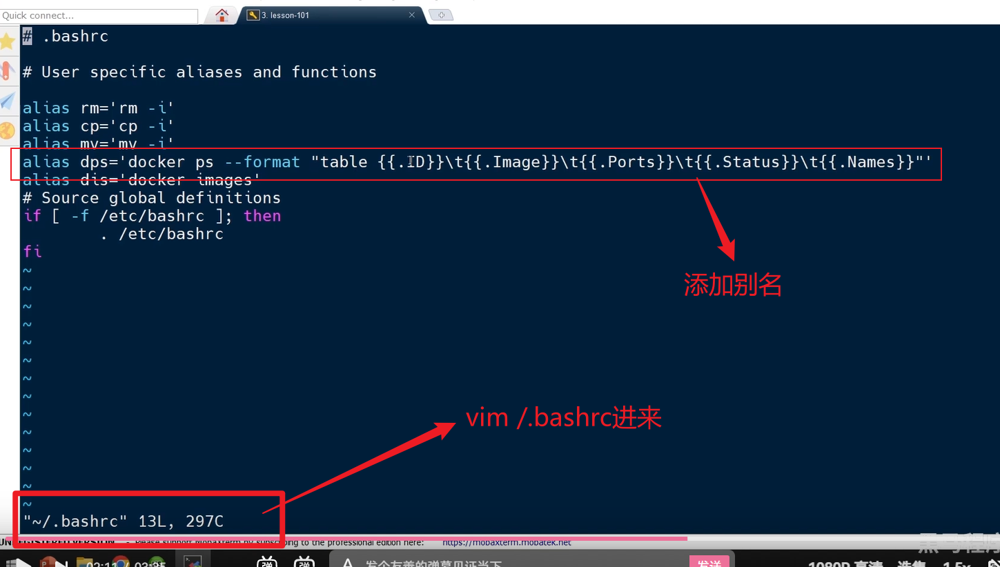

## 改完记得 source	~/.bashrc

---

---

## 数据卷


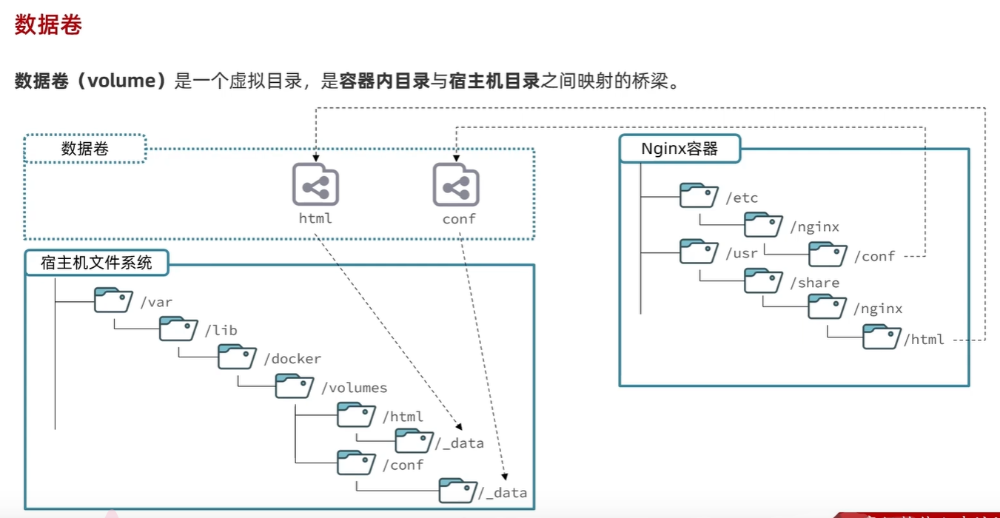

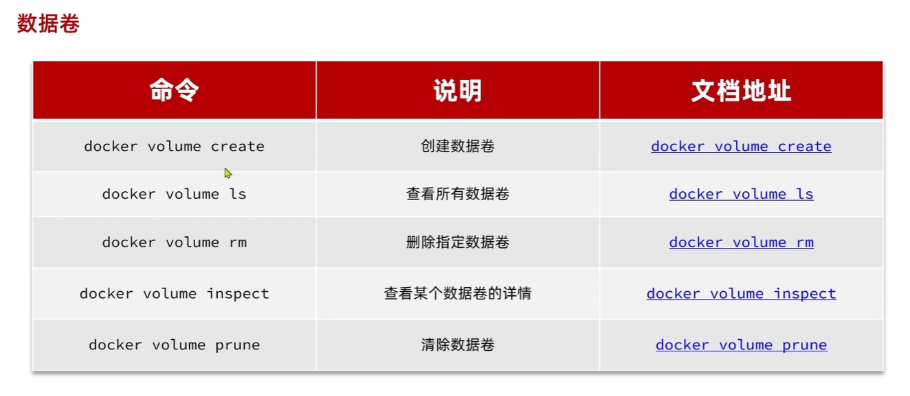

```bash
#不用记!!
docker volume --help
#全可看
```

### 默认挂载目录

```bash
/var/lib/docker/volumes/
```

### 练习03

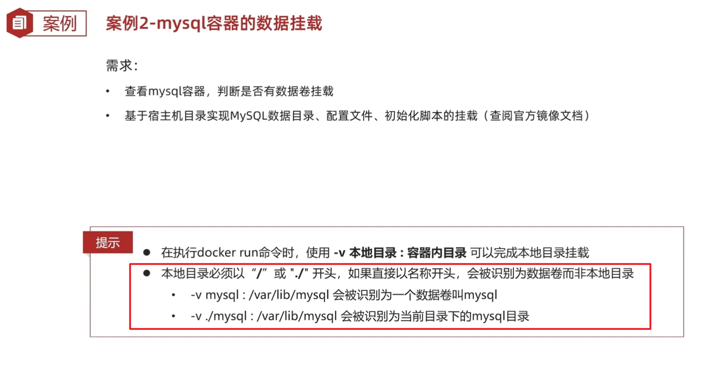

---

## 自定义镜像

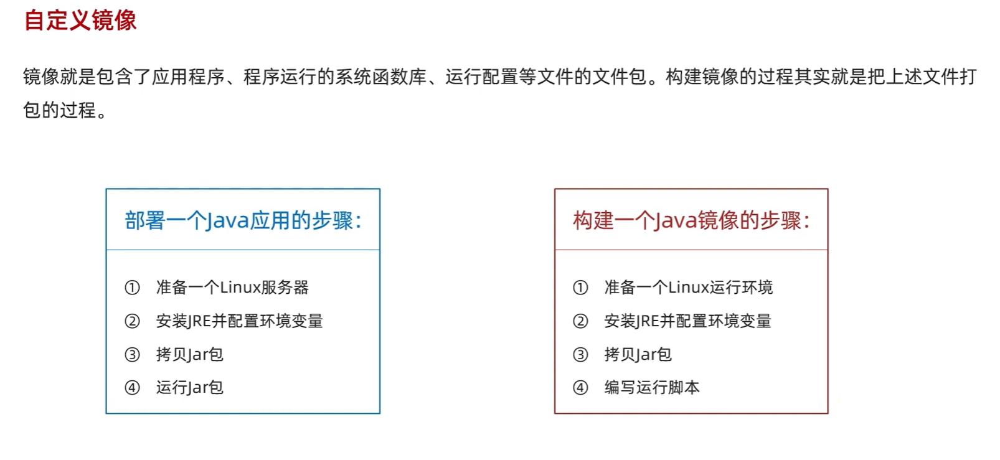

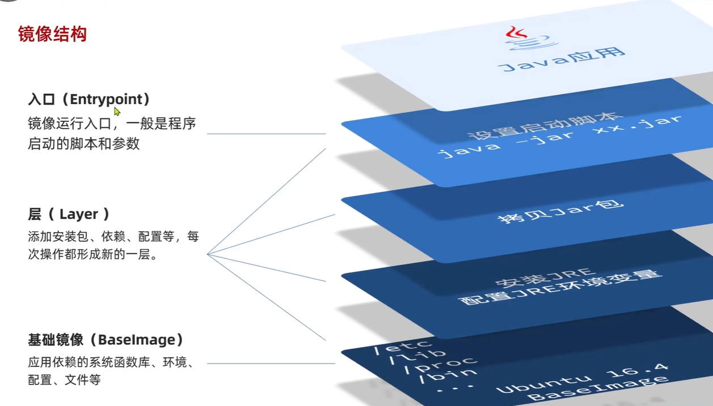

Dockerfile

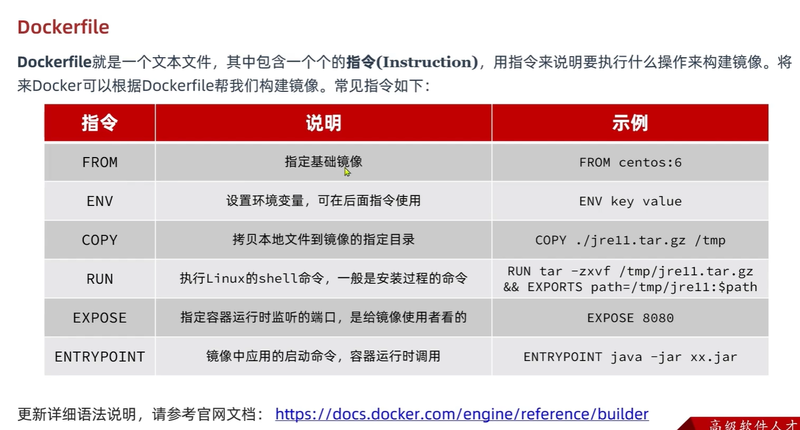

[视频](https://www.bilibili.com/video/BV1HP4118797?t=1122.1&p=9)

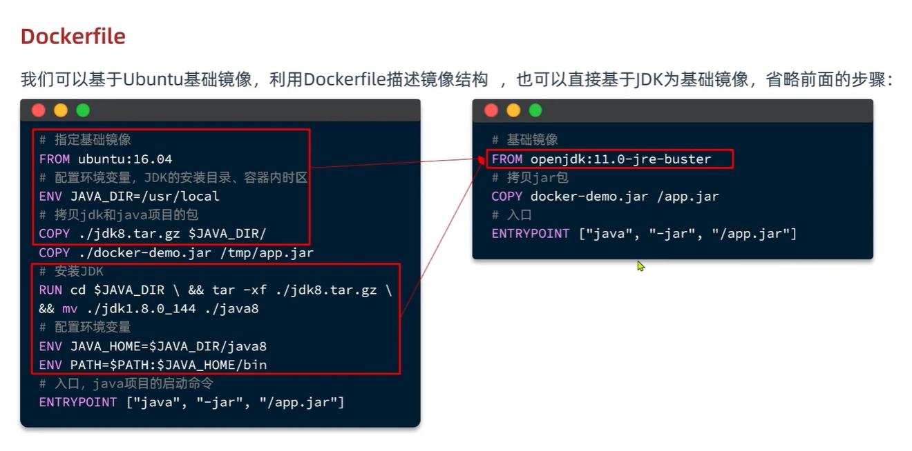

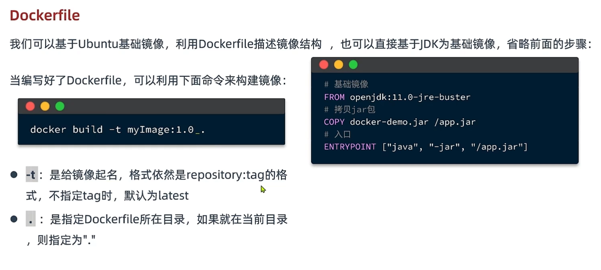

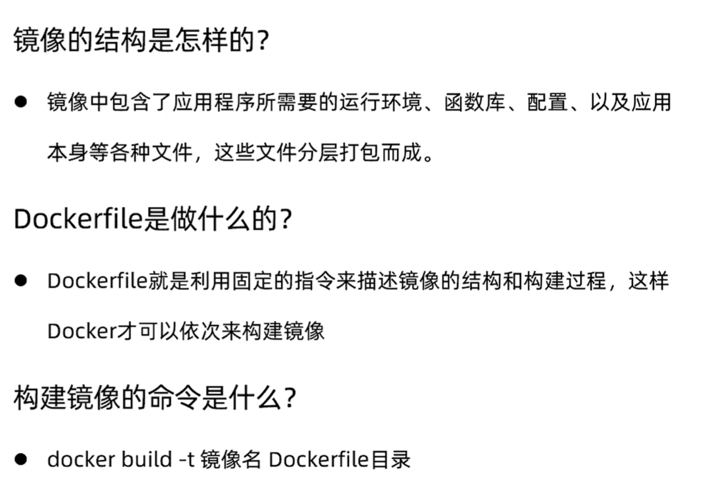

---

## 网络

容器的每次次运行都会获得一个新IP

所以使用IP关联的方式不好

所以

## 自定义网络

**创建新的网桥(网关)**

**可用容器名访问 ! ! ! ! **

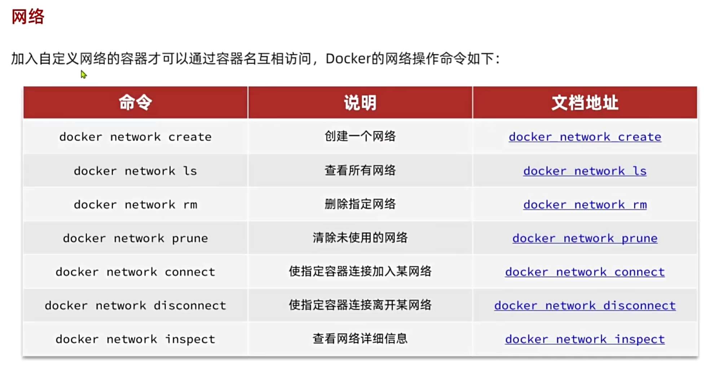

```bash
#同样,忘记可以使用 --help
docker network --help
```


创建容器的同时加入自定义网桥

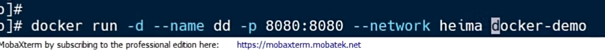


---

# 部署java应用

## 后端部分

打包(和dockerfile放到一起),构建镜像,运行容器

```bash
docker build -t
```

## 前端部署

---

## DockerCompose


### dockercompose命令

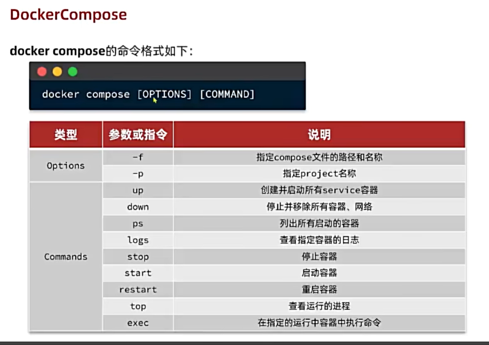
