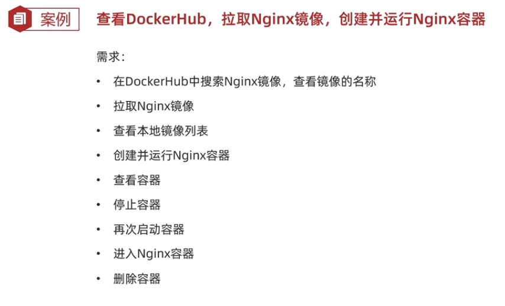
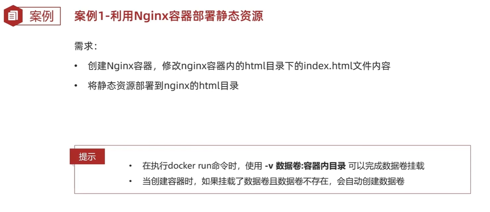

## docker-练习

## 练习01



## 练习02


## 练习03



## 给镜像改名

```bash
# 查看现有镜像
docker images

# 给镜像重命名（不改变标签）
docker tag ubuntu:latest my-ubuntu:latest

# 同时改名和改标签
docker tag nginx:latest my-nginx:v1.0

# 改名并指定新的仓库
docker tag local-image:latest yourusername/image-name:tag
```


## docker安装详细

apt仓库安装

```bash
# 更新软件包索引
sudo apt update

# 安装依赖
sudo apt install apt-transport-https ca-certificates curl gnupg lsb-release

# 添加 Docker 官方 GPG 密钥
curl -fsSL https://download.docker.com/linux/ubuntu/gpg | sudo gpg --dearmor -o /usr/share/keyrings/docker-archive-keyring.gpg

# 添加 Docker 仓库
echo "deb [arch=$(dpkg --print-architecture) signed-by=/usr/share/keyrings/docker-archive-keyring.gpg] https://download.docker.com/linux/ubuntu $(lsb_release -cs) stable" | sudo tee /etc/apt/sources.list.d/docker.list > /dev/null

# 更新软件包索引
sudo apt update

# 安装 Docker
sudo apt install docker-ce docker-ce-cli containerd.io
```

安装后配置

```bash
# 启动 Docker 服务
sudo systemctl start docker

# 设置开机自启
sudo systemctl enable docker

# 将当前用户添加到 docker 组（避免每次使用 sudo）
sudo usermod -aG docker $USER

# 重新登录或执行以下命令使分组生效
newgrp docker
```

验证安装

```bash
# 检查 Docker 版本
docker --version

# 运行测试容器
docker run hello-world
```

安装docker compose

```bash
# 下载最新版本的 Docker Compose
sudo curl -L "https://github.com/docker/compose/releases/latest/download/docker-compose-$(uname -s)-$(uname -m)" -o /usr/local/bin/docker-compose

# 添加执行权限
sudo chmod +x /usr/local/bin/docker-compose

# 验证安装
docker-compose --version
```


