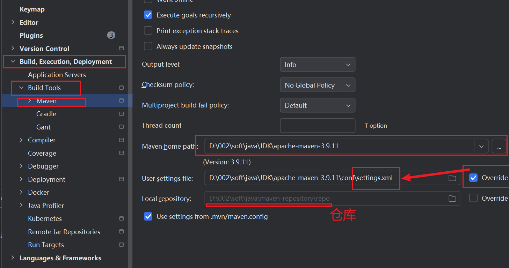
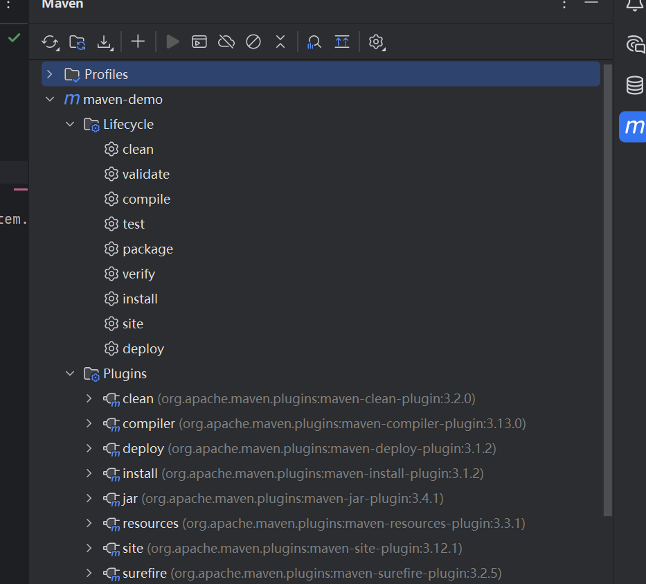

# Maven


配置

```maven
<localRepository>D:\002\soft\java\maven-repository\repo</localRepository>

-----------------------------------------------------

 <mirror>
      <id>aliyunmaven</id>
      <mirrorOf>*</mirrorOf>
      <name>阿里云公共仓库</name>
      <url>https://maven.aliyun.com/repository/public</url>
    </mirror>
  
  ----------------------------------------
  
  <profile>
    <id>jdk-18</id>

    <activation>
        <activeByDefault>true</activeByDefault>
        <jdk>18</jdk>
    </activation>

    <properties>
        <project.build.sourceEncoding>UTF-8</project.build.sourceEncoding>
        <maven.compiler.source>18</maven.compiler.source>
        <maven.compiler.target>18</maven.compiler.target>
        <maven.compiler.compilerVersion>18</maven.compiler.compilerVersion>
    </properties>
</profile>
```

生成maven项目结构

```maven
mvn archetype:generate -DgroupId=com.mycompany.app -DartifactId=my-app -DarchetypeArtifactId=maven-archetype-quickstart -DarchetypeVersion=1.5 -DinteractiveMode=false
```

## !	!	Windows每个参数都要打双引号,不然会报错	!	!

如下:

```maven
mvn archetype:generate -DgroupId="com.lantiancong" -DartifactId="maven-sample" -DarchetypeArtifactId="maven-archetype-quickstart" -DarchetypeVersion="1.5" -DinteractiveMode="false"
```

这里cd到maven-sample之后再输入

> mvn	compile

> mvn	package

```bash
java -cp target/maven-sample-1.0-SNAPSHOT.jar com.lantiancong.App
```


## IDEA中使用Maven

IDEA的设置如下



mvn + 以下有对应效果



[视频](https://www.bilibili.com/video/BV1uApMeWErY?t=137.3&p=7)

[依赖坐标查找](https://mvnrepository.com/)

[Maven Repository: Search/Browse/Explore](https://mvnrepository.com/)

> 本次学maven的目标坐标找到了
>

```xml
<project xmlns="http://maven.apache.org/POM/4.0.0" xmlns:xsi="http://www.w3.org/2001/XMLSchema-instance"
         xsi:schemaLocation="http://maven.apache.org/POM/4.0.0 http://maven.apache.org/maven-v4_0_0.xsd">
  <modelVersion>4.0.0</modelVersion>
  <groupId>com.lan</groupId>
  <artifactId>javaweb-01-maven</artifactId>
  <packaging>war</packaging>
  <version>1.0-SNAPSHOT</version>
  <name>javaweb-01-maven Maven Webapp</name>
  <url>http://maven.apache.org</url>

  <!-- 配置属性 -->
  <properties>
    <!-- Java版本指定为1.8 -->
    <maven.compiler.source>1.8</maven.compiler.source>
    <maven.compiler.target>1.8</maven.compiler.target>
    <project.build.sourceEncoding>UTF-8</project.build.sourceEncoding>
    <!-- Spring版本统一管理为5.3.x最新稳定版 -->
    <spring.version>5.3.29</spring.version>
  </properties>

  <dependencies>
    <!-- JUnit测试 -->
    <dependency>
      <groupId>junit</groupId>
      <artifactId>junit</artifactId>
      <version>4.13.2</version> <!-- 升级到兼容Java 8的新版本 -->
      <scope>test</scope>
    </dependency>

    <!-- Spring核心依赖 -->
    <dependency>
      <groupId>org.springframework</groupId>
      <artifactId>spring-webmvc</artifactId>
      <version>${spring.version}</version> <!-- 使用统一版本变量 -->
    </dependency>

    <dependency>
      <groupId>org.springframework</groupId>
      <artifactId>spring-jdbc</artifactId>
      <version>${spring.version}</version>
    </dependency>

    <!-- Servlet API -->
    <dependency>
      <groupId>javax.servlet</groupId>
      <artifactId>javax.servlet-api</artifactId>
      <version>3.1.0</version>
      <scope>provided</scope> <!-- 容器会提供，打包时不包含 -->
    </dependency>

    <!-- JSP API -->
    <dependency>
      <groupId>javax.servlet.jsp</groupId>
      <artifactId>javax.servlet.jsp-api</artifactId>
      <version>2.3.3</version>
      <scope>provided</scope>
    </dependency>

    <!-- JSTL标签库 -->
    <dependency>
      <groupId>javax.servlet.jsp.jstl</groupId>
      <artifactId>javax.servlet.jsp.jstl-api</artifactId>
      <version>1.2.2</version>
    </dependency>

    <!-- 数据库连接池（可选，根据需要添加） -->
    <dependency>
      <groupId>com.alibaba</groupId>
      <artifactId>druid</artifactId>
      <version>1.2.16</version>
    </dependency>

  </dependencies>

  <build>
    <finalName>javaweb-01-maven</finalName>
    <!-- 配置Maven编译插件 -->
    <plugins>
      <plugin>
        <groupId>org.apache.maven.plugins</groupId>
        <artifactId>maven-compiler-plugin</artifactId>
        <version>3.8.1</version>
        <configuration>
          <!-- 明确指定编译版本，与properties中保持一致 -->
          <source>1.8</source>
          <target>1.8</target>
        </configuration>
      </plugin>
      <!-- 配置Tomcat插件（方便运行Web项目） -->
      <plugin>
        <groupId>org.apache.tomcat.maven</groupId>
        <artifactId>tomcat7-maven-plugin</artifactId>
        <version>2.2</version>
        <configuration>
          <port>8080</port> <!-- 端口号 -->
          <path>/</path>    <!-- 上下文路径 -->
        </configuration>
      </plugin>
    </plugins>
  </build>
</project>

```

